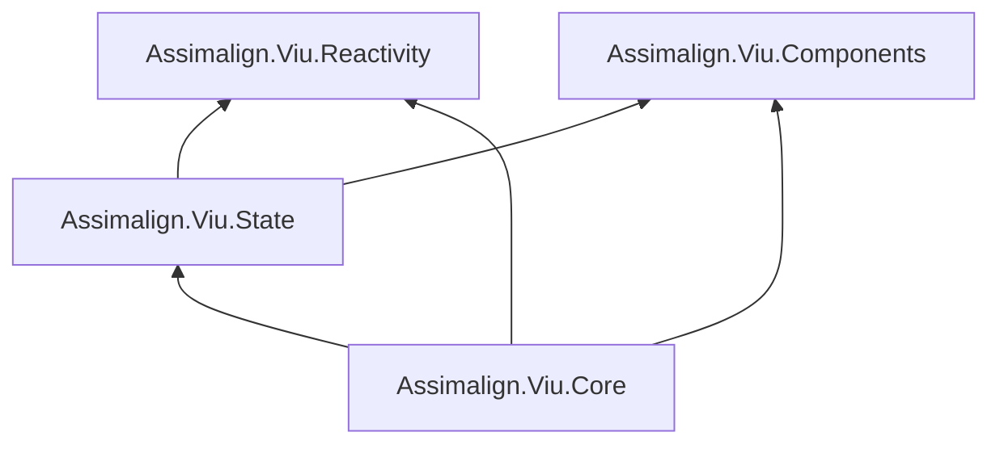

# Proposed Viu abstraction split

**Status:** Proposed for review. No shipping code depends on this scaffold.

## Goals

1. Split the current `Assimalign.Viu.Core` surface into Components, Reactivity, State, and Core.
2. Replace the public `VirtualNode` vocabulary with one component-tree vocabulary: every render-tree
   value implements `IComponent`.
3. Remove Viu's custom service container, service registrations, service lifetimes, and
   `DependencyInjection.GetService` facade from the application model.
4. Make `System.IServiceProvider` first-class and use `IComponentFactory` for both component
   activation and service resolution.
5. Preserve trimming and WASM/NativeAOT safety: activation is explicit delegate dispatch, never
   constructor discovery, `Activator.CreateInstance`, reflection scanning, or dynamic code.

## Proposed project graph



`Components` and `Reactivity` are independent foundations. `State` composes the reactive lifetime
with optional component ownership. `Core` integrates the three into the application and renderer.

The graph deliberately follows the requested Core-to-State dependency for this scaffold. A strong
alternative is to keep State optional and remove `Core -> State`; see Open decisions.

## One tree vocabulary, three different lifetimes

The public tree is unified, but three roles remain distinct:

| Role | Proposed type | Lifetime | Why it must remain distinct |
| --- | --- | --- | --- |
| Render description | `IComponent` and its specialized interfaces | Recreated by each render | Diff input: kind, key, arguments, children, and compiler hints |
| Reusable authoring contract | `IComponentTemplate` | Instantiated once per mounted template node | Runs setup and owns instance-local closures |
| Runtime bookkeeping | Internal Core instance | Mount to unmount | Host handles, effect, scheduler job, parent/root links, previous tree |

This is a vocabulary consolidation, not a claim that these three objects can safely become one
object. Vue 3.5 also keeps a vnode, a concrete component type, and a component internal instance
separate:

- [`vnode.ts`](https://github.com/vuejs/core/blob/v3.5.29/packages/runtime-core/src/vnode.ts)
- [`component.ts`](https://github.com/vuejs/core/blob/v3.5.29/packages/runtime-core/src/component.ts)
- [`renderer.ts`](https://github.com/vuejs/core/blob/v3.5.29/packages/runtime-core/src/renderer.ts)

The requested model is therefore an intentional public-shape divergence from Vue, while patch,
identity, lifecycle, and scheduling behavior should continue to match Vue 3.5.

### Component tree

`IComponent` replaces the public role of `VirtualNode`. Its `Kind` and `Key` are the common diff
identity. Specialized contracts carry only fields meaningful to that kind:

- `IElementComponent`
- `ITemplateComponent`
- `ITextComponent`
- `ICommentComponent`
- `IStaticComponent`
- `IFragmentComponent`
- `ITeleportComponent`

Teleport belongs to the component-tree vocabulary but remains a special renderer operation. It
cannot be lowered to an ordinary template component because it owns anchors in one container and
children in another.

The scaffold uses read-only collections. The LINQPad sketch used mutable `ICollection<T>` contracts;
mutating a previous render description after it has become renderer-owned makes diffing
nondeterministic.

### Template activation

`ITemplateComponent` is a render-tree request identified by `TemplateType`. It is not the activated
user object. Core asks `IComponentFactory.Create(TemplateType)` for an `IComponentTemplate` when it
mounts the node. That gives every mount a fresh setup closure and prevents two mounts of the same
template from sharing lifecycle or reactive state accidentally.

`IComponentTemplate.Setup(IComponentContext)` returns `ComponentRenderer`, which produces the next
`IComponent` subtree. Arguments, events, services, and instance-local lifecycle registration live
on `IComponentContext`.

Lifecycle callbacks are intentionally not stored on reusable template metadata. Doing so would
share callbacks across mounts. They are registered through the instance context during setup.

## Component factory and service resolution

```csharp
public interface IComponentFactory : IServiceProvider
{
    IComponentTemplate Create(Type componentType);
    IComponentTemplate Create(string name);
}
```

The same object is visible as both `IComponentFactory` and `IServiceProvider`. Its semantics are
strict:

- `Create(...)` creates a fresh component template for a mount.
- `GetService(...)` resolves an application dependency and never implicitly creates a component.
- Component registrations are explicit `Func<IServiceProvider, IComponentTemplate>` delegates.
- A factory may wrap any external `IServiceProvider`.
- The wrapper does not own or dispose the external provider unless a later ownership contract says
  so.

This removes Viu's custom `IServiceContainer`, `ServiceRegistration`, `ServiceLifetime`, and
`FactoryServiceProvider` model. It does not remove dependency resolution as a design concept;
`IServiceProvider` is dependency injection's standard .NET resolver contract.

One concern is role coupling: a component activator and a general dependency resolver have different
lifetimes and failure semantics. The scaffold follows the requested combined interface. The cleaner
alternative is `IComponentFactory` with a `Services` property, leaving it separate from
`IServiceProvider`.

## Package responsibilities

### Assimalign.Viu.Components

- Public component-tree contracts and concrete tree values.
- Template metadata, setup context, arguments, events, lifecycle registration, and directives.
- `IComponentFactory`, explicit component registrations, and the provider-backed default factory.
- No dependency on Reactivity, State, Core, a renderer, or a browser host.

Keeping Components independent of Reactivity is deliberate. A component author can use Reactivity,
but the component-tree model itself does not require it. Core is where a component renderer becomes
a reactive render effect.

### Assimalign.Viu.Reactivity

- The existing reactive value, dependency, subscriber, effect, scope, collection, watch, and
  generator contracts moved out of Core.
- No dependency on Components, State, or Core.
- The scaffold includes only the boundary types needed to prove the split; the later refactor would
  move the current implementation and its tests rather than rewrite the engine.

### Assimalign.Viu.State

- Application state/store definitions, registry, and effect-scope ownership.
- Depends on Reactivity for reactive lifetime and Components for optional component ownership and
  the shared service resolver.
- The scaffold intentionally avoids finalizing whether this is a rename/replacement of
  `Assimalign.Viu.Store`; that is an open product decision.

### Assimalign.Viu.Core

- Application, application builder/context, renderer, scheduler integration, hydration, built-ins,
  and coordination between Components and Reactivity.
- Holds internal mounted-instance state and renderer-owned host pointers.
- Accepts an already-composed `IComponentFactory`; it does not build a service container.
- Uses the `Assimalign.Viu` root namespace as the existing recorded exception.

## Renderer lowering

The public interfaces are an authoring and package boundary, not necessarily the hot-path storage
shape. Before patching, Core should normalize an `IComponent` into an internal sealed or
abstract-base node family with direct fields. This preserves the repository's hot-path dispatch
rule and avoids paying repeated interface calls throughout keyed diffing on mono-wasm/NativeAOT.

The lowering step also owns compiler patch flags, block dynamic children, host handles, anchors,
directive bindings, transitions, and application context. Those are renderer details and should
not widen every public component interface.

## AOT and source generators

The default factory is AOT-safe because component construction is a registered delegate. A future
source generator can emit:

```csharp
new ComponentRegistration(
    "TodoItem",
    typeof(TodoItem),
    services => new TodoItem((ITodoRepository)services.GetService(typeof(ITodoRepository))!));
```

No runtime constructor selection is permitted. `Type` is only a stable lookup key created through
`typeof(T)`, not a prompt for reflection activation.

The shipping refactor must also split the current generator responsibilities:

- Reactive-object generation moves with Reactivity.
- Single-file component output targets the Components contracts.
- Generated render helpers target Core's integration surface.

## Design concerns

1. **State may not belong in Core's mandatory closure.** A Pinia-style state package is normally
   optional. If Core references State, every Viu application carries it and the dependency graph
   cannot express a minimal renderer-only app. Recommendation: consider dropping `Core -> State`
   before implementation and have the SDK/framework pack reference both.
2. **`IComponentFactory : IServiceProvider` couples two roles.** It is workable with the strict
   semantics above, but `IComponentFactory.Services` is easier to adapt to scoped containers and
   makes ownership clearer.
3. **`IServiceProvider` does not define scopes or disposal ownership.** The application must know
   whether the supplied provider is externally owned. Per-component service scopes need an explicit
   activation-scope contract if they are required.
4. **Template identity cannot be the activated object.** Diff identity must remain template type +
   key. Factory output is per-mount runtime state and cannot decide whether two render passes
   represent the same node.
5. **The term Component now has two common meanings.** The proposal consistently uses “component”
   for every tree value and “component template” for user-authored behavior. If that reads poorly,
   `IRenderNode` + `IComponent` is clearer but does not meet the requested vocabulary.
6. **State versus Store is unresolved.** If State is the successor to the current Pinia-style Store
   package, the migration and compatibility story needs a decision. If State is only low-level
   state primitives, it should not absorb Store.
7. **Compiler flags must remain cheap.** A pure interface graph should not replace the current
   compact patch and shape flags on the hot path. They belong in Core's internal lowered node.

## Open decisions requiring sign-off

1. Should Core reference State, or should State remain optional?
2. Is `Assimalign.Viu.State` a rename/replacement of `Assimalign.Viu.Store`, or a new lower-level
   package?
3. Keep `IComponentFactory : IServiceProvider`, or prefer
   `IComponentFactory.Services : IServiceProvider`?
4. Does the application own and dispose the supplied factory/provider?
5. Are service scopes application-wide only, or is one scope required per mounted template?
6. Are the proposed terms `IComponent` (tree value) and `IComponentTemplate` (authored behavior)
   acceptable?
7. Should component lookup support both `Type` and registered string names in v1?
8. Should Core lower public component interfaces into an internal sealed node representation, or
   should public concrete component nodes be the hot-path representation?

