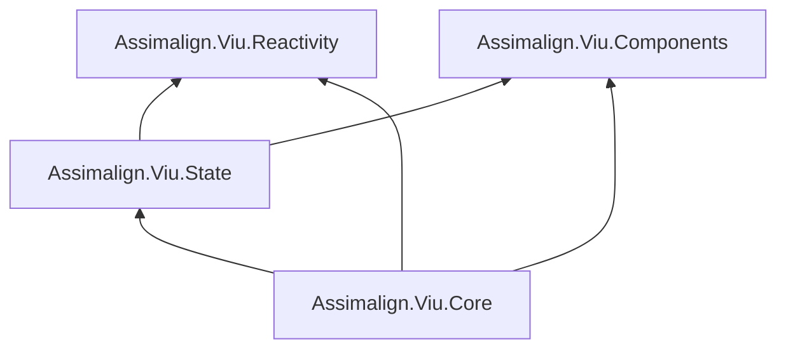

# Proposed Viu abstraction split

**Status:** Proposed for review. No shipping code depends on this scaffold.

## Goals

1. Split the current `Assimalign.Viu.Core` surface into Components, Reactivity, State, and Core.
2. Replace the public `VirtualNode` vocabulary with one component-tree vocabulary: every
   render-tree value implements `IComponent`.
3. Remove Viu's custom service container, service registrations, service lifetimes, and
   `DependencyInjection.GetService` facade from the application model.
4. Keep `IComponentFactory` focused on component resolution. Treat `System.IServiceProvider` as an
   independently supplied application-layer decision.
5. Preserve trimming and WASM/NativeAOT safety: activation is explicit delegate dispatch, never
   constructor discovery, `Activator.CreateInstance`, reflection scanning, or dynamic code.
6. Preserve Vue-shaped reactivity APIs and Vue's compiler-informed block-tree patching.

## Proposed project graph



`Components` and `Reactivity` are independent foundations. `State` composes reactive lifetime with
optional component ownership. `Core` integrates the three into the application and renderer.

The graph deliberately follows the requested Core-to-State dependency for this scaffold. A strong
alternative is to keep State optional and remove `Core -> State`; see Open decisions.

## One tree vocabulary, three different lifetimes

The public tree is unified, but three roles remain distinct:

| Role | Proposed type | Lifetime | Why it remains distinct |
| --- | --- | --- | --- |
| Render description | `IComponent` and specialized interfaces | Recreated by each render | Diff input: kind, key, arguments, children, and compiler hints |
| Reusable authoring contract | `IComponentTemplate` | Instantiated once per mounted template node | Runs setup and owns instance-local closures |
| Runtime bookkeeping | Internal Core instance | Mount to unmount | Host handles, render effect, scheduler job, parent/root links, previous tree |

This is a vocabulary consolidation, not a claim that all three roles can safely become one object.
Vue 3.5 also keeps vnode, component type, and internal component instance roles separate:

- [`vnode.ts`](https://github.com/vuejs/core/blob/v3.5.29/packages/runtime-core/src/vnode.ts)
- [`component.ts`](https://github.com/vuejs/core/blob/v3.5.29/packages/runtime-core/src/component.ts)
- [`renderer.ts`](https://github.com/vuejs/core/blob/v3.5.29/packages/runtime-core/src/renderer.ts)

The requested model is therefore an intentional public-shape divergence from Vue, while patch,
identity, lifecycle, and scheduling behavior should continue to match Vue 3.5.

### Component tree

`IComponent` replaces the public role of `VirtualNode`. Its `Kind` and `Key` are the common diff
identity. Specialized contracts carry only fields meaningful to that kind:

- `IElementComponent`
- `ITemplateComponent`
- `ITextComponent`
- `ICommentComponent`
- `IStaticComponent`
- `IFragmentComponent`
- `ITeleportComponent`

Teleport remains a special renderer operation. It cannot be lowered to an ordinary template
component because it owns anchors in one container and children in another.

The scaffold uses read-only collections. Mutating a previous render description after it has become
renderer-owned makes diffing nondeterministic.

### Template activation

`ITemplateComponent` is a render-tree request identified by `TemplateType`; it is not the activated
user object. Core asks `IComponentFactory.Create(TemplateType)` for an `IComponentTemplate` when it
mounts the node. Every mount receives a fresh setup closure so lifecycle and reactive state are not
accidentally shared.

`IComponentTemplate.Setup(IComponentContext)` returns `ComponentRenderer`, which produces the next
`IComponent` subtree. Arguments, events, the selected component resolver, application services, and
instance-local lifecycle registration live on `IComponentContext`. The component and service
resolvers are independent.

Lifecycle callbacks belong to the mounted instance context, not reusable template metadata.
`IComponentLifecycle` exposes named typed hooks and the component-lifetime cancellation token.
Synchronous setup registers asynchronous lifecycle task factories; Core observes their tasks
without delaying ordinary lifecycle progression, routes faults through component error handling,
and cancels the token after invoking before-unmount callbacks but before effect-scope and subtree
teardown. Server prefetch is distinct because server-side rendering awaits it. Task-returning host
and component-event handlers use the same internal observation mechanism without exposing a public
task-manager abstraction.

## Component factory and application services

```csharp
public interface IComponentFactory
{
    IComponentTemplate Create(Type componentType);
    IComponentTemplate Create(string name);
}
```

- `Create(...)` returns a fresh component template for one mount.
- The factory decides only how a component is resolved.
- The built-in example factory uses explicit parameterless activators. An activator may close over
  a generated resolver, `IServiceProvider`, hand-written composition root, or another
  application-owned mechanism.
- A custom factory may implement `IServiceProvider`, but Viu does not require or assume that it
  does.
- `IApplicationContext.Components` and `IApplicationContext.Services` remain separate.

This removes Viu's custom `IServiceContainer`, `ServiceRegistration`, `ServiceLifetime`, and
`FactoryServiceProvider` model. The application may still expose the standard .NET
`IServiceProvider` contract without making Components depend on a particular activation strategy.

## Reactivity boundary

Commit `80bb967` is the documentation tail of the earlier consolidation. The code baseline that
matters for restoring the package is `470142e`, the last snapshot with a standalone
`Assimalign.Viu.Reactivity`; `0fe2d9c` then moved it into RuntimeCore.

The redesign restores the standalone package responsibility while preserving improvements made in
Core after consolidation. The static `Reactive` facade remains Vue-shaped:

- references: `Reference`, `ShallowReference`, `CustomReference`, and `Computed`;
- effects and scopes: `Effect`, `EffectScope`, current-scope lookup, and scope disposal;
- watchers: `Watch`, `WatchEffect`, options, cleanup, handle, and scheduler contracts;
- utilities: `TriggerReference`, `IsRef`, `Unref`, `ToRef`, reactive/read-only checks, `ToRaw`, and
  `MarkRaw`;
- engine controls: tracking pause/reset and batching;
- AOT adaptations of `reactive()`: generated `[Reactive]` types and dedicated reactive
  collections.

The original reference interfaces return as `IReactiveReference` and
`IReactiveReference<T>`. First-party implementations continue to derive from
`ReactiveValue`/`ReactiveValue<T>` so the public substitution contract does not move engine state
or hot-path dispatch onto interfaces. All Reactivity-owned interfaces use an `IReactive` prefix;
the complete rename map is in the package design.

The package design is detailed in
[Assimalign.Viu.Reactivity/docs/DESIGN.md](Assimalign.Viu.Reactivity/docs/DESIGN.md).

## Block-tree update path

The merged component tree can retain Vue's block-tree update strategy, but optimization data cannot
exist only on the removed `VirtualNode`. The scaffold therefore adds `ComponentOptimization` to
every `IComponent`. It carries:

- `PatchFlags`;
- dynamic property names;
- the block root's dynamic descendants; and
- the `v-once`/suspended-tracking marker.

The intended flow is:

1. Generated render code opens a block while creating a structurally stable region.
2. Tree creation records descendants whose positive patch flags make them dynamic.
3. Closing the block attaches that snapshot to the block root's `ComponentOptimization`.
4. Core lowers old and new component trees without discarding the metadata.
5. Compatible old/new block roots use the renderer's block-child fast path; incompatible or
   unoptimized roots use the normal full diff.

`v-if` branches and `v-for` fragments still establish nested block boundaries. A non-null empty
dynamic-children list must remain distinguishable from null: empty means “optimized block with no
dynamic descendants,” while null means “not a block.”

This preserves the algorithm in Vue's `openBlock`/`createBlock` and `patchBlockChildren`; only the
public C# tree vocabulary changes.

## Package responsibilities

### Assimalign.Viu.Components

- Public component-tree contracts and concrete tree values.
- Compiler/runtime optimization metadata for the unified tree.
- Template metadata, setup context, arguments, events, lifecycle registration, and directives.
- `IComponentFactory`, explicit registrations, and a resolver-neutral default factory.
- No dependency on Reactivity, State, Core, a renderer, or a browser host.

Components references Shared for the existing compiler/runtime `PatchFlags` vocabulary.

### Assimalign.Viu.Reactivity

- Restored standalone home for the reactive value, dependency, subscriber, effect, scope,
  collection, watch, traversal, introspection, and generator contracts.
- No dependency on Components, State, or Core.
- Moves the current proven engine and tests rather than rewriting them.

### Assimalign.Viu.State

- Application state/store definitions, registry, and effect-scope ownership.
- Depends on Reactivity for lifetime and Components for optional component ownership/resolution.
- Receives application services separately from the component factory.
- Replaces `Assimalign.Viu.Store`; the refactor migrates Store behavior into State instead of
  maintaining both packages.

### Assimalign.Viu.Core

- Application composition, renderer, scheduler integration, hydration, built-ins, and coordination.
- Holds internal mounted-instance state and renderer-owned host pointers.
- Accepts independently composed `IComponentFactory` and `IServiceProvider` instances.
- Uses the `Assimalign.Viu` root namespace as the existing recorded exception.

## Renderer lowering

Public interfaces are authoring/package boundaries, not necessarily hot-path storage. Core should
normalize an `IComponent` into an internal sealed or abstract-base node family with direct fields.
This preserves the repository's hot-path dispatch rule on mono-wasm/NativeAOT.

Lowering copies `ComponentOptimization` into direct fields. Because `DynamicChildren` points back
to values in the public tree, normalization must use a per-render reference-identity map and then
translate each dynamic child to the corresponding lowered node. Core additionally owns host
handles, anchors, directive bindings, transitions, and application context. Optimization promises
originate at compile/tree-creation time; Core consumes them but must not infer or silently discard
them.

## AOT and source generators

The default factory is AOT-safe because construction uses registered delegates:

```csharp
new ComponentRegistration(
    typeof(TodoItem),
    () => new TodoItem(
        (ITodoRepository)applicationServices.GetService(typeof(ITodoRepository))!),
    "TodoItem");
```

The captured resolver is an application decision, not part of `IComponentFactory`. No runtime
constructor selection is permitted. `Type` is a stable lookup key created through `typeof(T)`, not
a prompt for reflection activation.

The shipping refactor must split generator responsibilities:

- reactive-object generation moves with Reactivity;
- single-file component output targets Components;
- generated render helpers target Core's integration surface and Components optimization metadata.

## Resolver ownership and component scopes

The application supplies `IComponentFactory` and `IServiceProvider` to Viu. They are borrowed
application objects:

- Viu does not dispose the supplied factory.
- Viu does not dispose the supplied service provider.
- The composition root that created either resolver remains responsible for its shutdown.
- State registries similarly borrow both resolvers while continuing to own and dispose the detached
  reactive scopes they create.

A component template returned by `IComponentFactory.Create(...)` has a different lifetime: it was
created for one mount, so Core owns that returned instance. The proposed default is:

- If setup fails, Core disposes the returned template when it implements `IDisposable`.
- On normal unmount, Core runs unmount lifecycle callbacks and then disposes the template when it
  implements `IDisposable`.
- Core never asks `IServiceProvider` for `IServiceScopeFactory` and never creates a dependency-
  injection scope automatically.

A custom factory may still implement per-component scope semantics. It creates a scope during
activation and returns a template (or template wrapper) that owns that scope. Disposing the
mount-owned template then disposes the scope. This keeps dependency-injection policy in the
application layer while giving Core an explicit resource-lifetime rule.

The scaffold records this as the recommended default pending final sign-off. If asynchronous
disposal or pooled activations are needed, they require an explicit activation-lifetime contract
rather than special-casing a dependency-injection implementation.

## Design concerns

1. **State may not belong in Core's mandatory closure.** A Pinia-style package is normally optional.
   Recommendation: consider dropping `Core -> State` and let the SDK/framework pack compose both.
2. **Asynchronous or pooled activation needs a richer lease.** The proposed optional
   `IDisposable` template convention covers ordinary per-mount resources but not asynchronous
   teardown or returning activations to a pool.
3. **Template identity cannot be the activated object.** Diff identity remains template type + key;
   factory output is per-mount runtime state.
4. **“Component” now has two common meanings.** The proposal uses “component” for every tree value
   and “component template” for authored behavior. `IRenderNode` + `IComponent` is clearer but does
   not meet the requested vocabulary.
5. **Optimization metadata must survive lowering.** Generated block tracking and lowering tests are
   still needed. Losing null-versus-empty dynamic-children semantics would silently break the fast
   path.
6. **Reactivity has two compatibility baselines.** `470142e` supplies the separated interface
   surface; current Core contains later engine improvements. The hybrid
   `IReactiveReference` + `ReactiveValue` model preserves both.
7. **Reactivity namespace compatibility needs a deliberate migration.** The old package used
   `Assimalign.Viu.Reactivity`; consolidated callers use `Assimalign.Viu`.
8. **Lowering dynamic children requires identity preservation.** Looking up a dynamic descendant by
   value equality is unsafe because custom components may override equality. The normalizer needs a
   reference-identity map or the renderer must use the public concrete tree directly.

## Open decisions requiring sign-off

1. Should Core reference State, or should State remain optional?
2. Approve the borrowed-resolver and mount-owned-disposable-template policy described above?
3. Are `IComponent` (tree value) and `IComponentTemplate` (authored behavior) acceptable terms?
4. Should component lookup support both `Type` and registered string names in v1?
5. Should Core lower public component interfaces, or use public concrete nodes on the hot path?
6. Should Reactivity restore `Assimalign.Viu.Reactivity` immediately, or should Core provide one
   compatibility release for consolidated `Assimalign.Viu` names?
