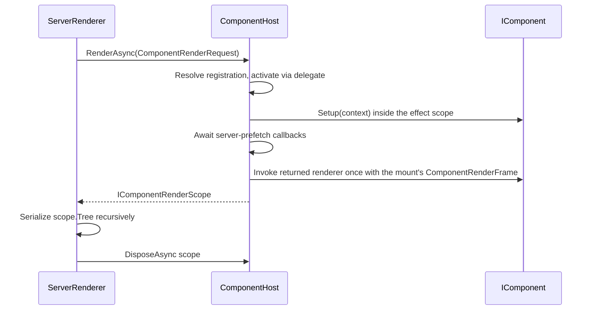

# End-state design

Adopted disposition: [`../../REDESIGN-REVIEW.md`](../../REDESIGN-REVIEW.md) §2/§2a. This document
summarizes what the scaffold models.

## One word no longer carries four lifetimes

The target model separates the four lifetimes that previously accumulated under "component":

| Lifetime | Target concept | Owner |
|---|---|---|
| Fresh immutable render description | `VirtualNode` and its sealed variants | Components |
| Static component identity and declared input/output contract | `ComponentReference`, `ComponentContract`, `ComponentRegistration` | Components |
| Authored behavior, one instance per mount | `IComponent`, abstract `ComponentContext`, `ComponentBase` | Components |
| Mounted reconciliation, scope, scheduling, and host-node bookkeeping | internal engine types (`RuntimeComponentContext`, mounted internals) | Core |

Components is **the component model** — vocabulary lives low. Core is **the Application Model**:
the engine plus the public operations hosts consume. Conventions (State, routing, whatever comes
next) attach through seams and never earn context members.

## Components

`VirtualNode` is a closed abstract base (`private protected` constructor); every shipping variant
is sealed, so a node's `Kind` and its type can never disagree. `CompositeVirtualNode` provides the
ordinary `Children` shape for elements and fragments. Control nodes expose their actual structure:

- `ComponentNode` carries a component reference and an immutable `ComponentInvocation`.
- `KeepAliveNode`, `SuspenseNode`, and `TransitionNode` each carry a `ComponentInvocation` —
  arguments plus **lazy** slots that stay unevaluated at description time.
- `TeleportNode` carries children and a host-resolved target identifier.

The authored contract also lives here: `IComponent { ComponentRenderer Setup(ComponentContext) }`,
the abstract `ComponentContext` (Bindings, Services, Lifecycle, Scope, WatchScheduler, Parent,
Emit, Expose, Warn, and a concrete `Watch` routed through `OnWatchError`), `ComponentBindings`
with its pure static `Resolve(contract, invocation, diagnostics)`, `ComponentLifecycle`,
`ComponentRegistration (Reference, Contract, Activator)`, and `IComponentFactory` /
`ComponentFactory`. The frozen `PatchFlags`/`SlotFlags`/`ShapeFlags` value contracts and
`NameNormalization` are Components-owned. Components references only Reactivity — change tracking
is intrinsic to the model; a component is a reactive render function.

A `ComponentRenderer` receives its mount's `ComponentRenderFrame` — the per-mount render cache
plus block assembly (`OpenBlock`/`Track`/`CloseBlock`, `CacheHandler`). There is no ambient
render-helper state and no public static helper class in the end state: the shipping static
render-helper surface, its `BlockToken`, and the underscore name-binding convention are
superseded, and compiled output binds through the frame parameter. Code-first components are
`ComponentRegistration.Define(name, contract, setup)` wrapping a `ComponentSetup` delegate —
composition-only per [ADR-0004](../../docs/adr/0004-composition-only-component-model.md), with no
options-object form. Hand-built subtrees carry `RenderPlan.None` and patch by full diff unless
the author supplies plans.

Deliberately absent everywhere: a style-scope identifier. **Scoped CSS is deferred** until after
the component-model arc; reintroduction is an additive member on the contract plus emission.

`RenderPlan.DynamicChildren` preserves the three-state block contract: `null` means no compatible
block metadata; an empty collection is a valid block with no dynamic descendants; a non-empty
collection is the direct dynamic-child patch list.

## Raw invocation versus resolved bindings

The parent-created request and the mounted component's resolved inputs deliberately have different
types with no shared interface:

```text
ComponentNode.Invocation              ComponentContext.Bindings
├─ Arguments                          ├─ Parameters
├─ Slots                              ├─ Slots
├─ Listeners                          └─ FallthroughBindings
└─ Directives
```

`ComponentBindings.Resolve` is the pure, unit-testable transformation (alias matching,
declared-versus-fallthrough splitting, required-parameter diagnostics). Per-mount concerns —
default caching, initial-mount warning gating — belong to the runtime, which reports the returned
diagnostics.

## The context seams

`ComponentContext` is **public abstract** in Components; Core's `RuntimeComponentContext` is the
single internal sealed implementation. A consumer-derived context is inert — no runtime API
accepts one. Conventions reach the context only through `Services` and the ambient reactive scope:
State's `Use(ComponentContext)` resolves `IStateStoreRegistry` from `context.Services`, then the
ambient active registry, and otherwise throws — no cast, no bridge interface, no privileged
member. Adding the next convention modifies nothing in Components or Core.

## Server rendering



`ComponentHost.RenderAsync` returns the public `IComponentRenderScope { Tree; Context }`; the
scope's `Context` is usable as the parent of a nested render. The concrete lease is internal. No
friend access, no downcast, and — with scoped CSS deferred — no style-scope attribute emission.

## Testing

Testing consumes public `MountedComponentView<TNode>` values (`Request`, `Instance`, `Context`,
`FirstHostNode`, `LastHostNode`, `IsMounted`). The engine caches one view per mounted node, so
reference identity is stable across enumerations; Testing reacquires views after a scheduler flush
instead of retaining engine objects.

## Hot reload

Generated code registers `ComponentDevelopmentMetadata` through the hidden
`ComponentCompilerServices` ABI in Core. Authored components implement no public hot-reload
metadata interface. The ABI is public only because generated consumer assemblies must call it
without reflection. This registration ABI (shipping `ComponentHotReload`) plus Browser's
directive vocabulary are the only name-bound generated-code contracts that remain — render
output binds through the `ComponentRenderFrame` parameter, never through statics imported by
name.

## Rendering granularity

The baseline remains one reactive render effect per mounted authored component. A reactive change
schedules only effects that read that value, and the resulting subtree patch uses `RenderPlan`
block metadata to visit direct dynamic descendants. A compiler block is a patch unit, not an
independent reactive subscriber. Per-block effects remain a separate benchmark-gated design.
