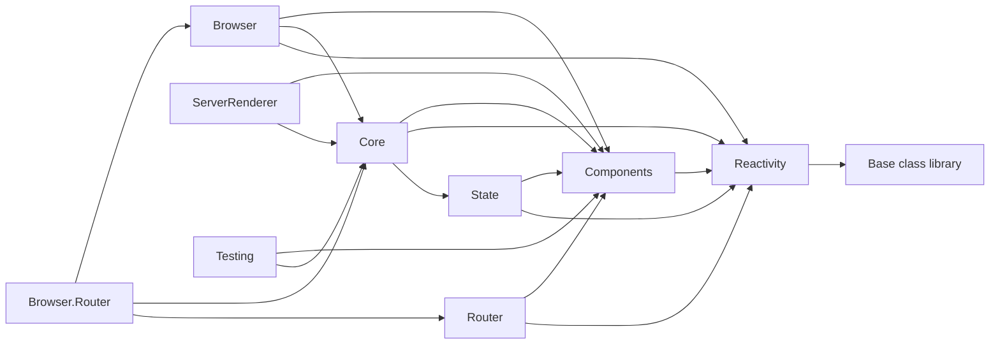

# Project graph

Arrows point from a consumer to its production dependencies.

## Rules

| Project | Production references | Boundary |
|---|---|---|
| Reactivity | none | Change tracking cannot depend on component or host policy. |
| Components | Reactivity | Owns vocabulary, never mounted execution or a convention. |
| State | Components, Reactivity | Attaches through services/ambient lifetime, never Core. |
| Router | Components, Reactivity | Owns route policy and history; never Core or Browser. |
| Core | Components, Reactivity, State | Owns application and renderer composition, never a host. |
| Browser | Components, Core, Reactivity | Owns DOM policy and browser scheduling. |
| Browser.Router | Browser, Core, Router | Owns only Browser application integration. |
| ServerRenderer | Components, Core | Owns HTML serialization, never browser handles. |
| Testing | Components, Core | Owns an in-memory host, never mounted internals. |

Router's two source references are intentionally exact: Components and Reactivity. The byte-frozen
history module loads exports from `Assimalign.Viu.Router`; moving that interop to Browser.Router
would change the published asset contract (`[RTR-3]`, `[RTR-7]`).
