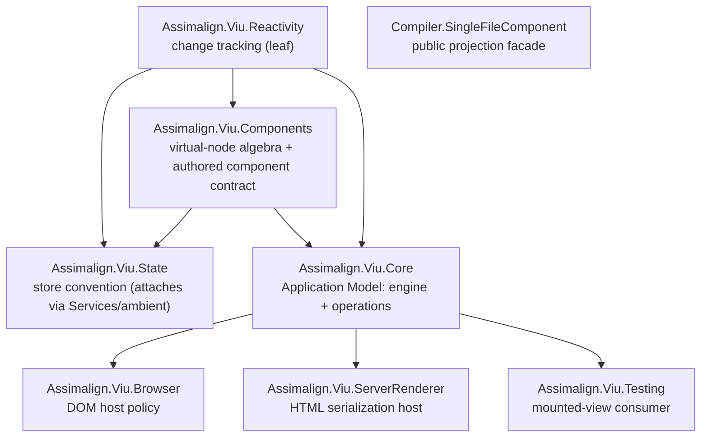

# Project graph

Adopted charter: [`../../REDESIGN-REVIEW.md`](../../REDESIGN-REVIEW.md) §2. Vocabulary lives low,
composition lives high, conventions attach through seams.

## Dependency rules

| Project | May reference | Must not know |
|---|---|---|
| Reactivity | Base class library | Components, State, Core, hosts |
| Components | Reactivity | State, Core, hosts — change tracking is intrinsic to the model; conventions are not |
| State | Reactivity, Components | Core, hosts — it attaches Router-style through `Services` and the ambient registry, never a cast or bridge interface |
| Core | Components, Reactivity | Browser and server policy (the shipping composition root may additionally reference State as composition sugar; the contract model does not need the edge) |
| Browser | Components, Core | Core internals |
| ServerRenderer | Components, Core | Core internals and browser DOM handles |
| Testing | Components, Core | Mounted engine implementation types |
| Compiler.SingleFileComponent | Syntax and compiler implementation projects in the real graph | Runtime internals and Roslyn types in its public result |

Hosts reference Core (and transitively Components); no host is a compile-time friend of Core.
`Assimalign.Viu.Shared` is absent. Every former Shared concept moves to a domain owner (the frozen
flag enums and `NameNormalization` land in Components) or is deleted; a miscellaneous abstraction
package is not part of the target graph.
