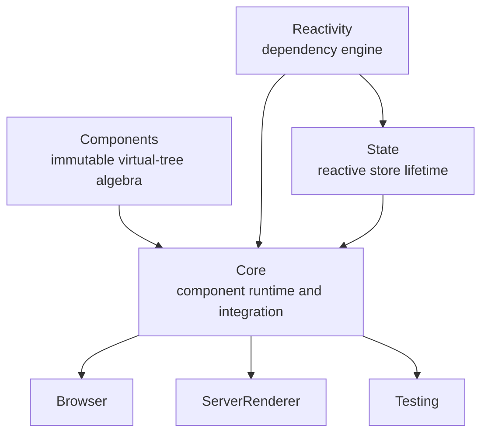
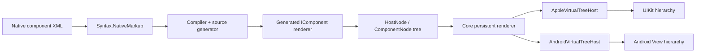
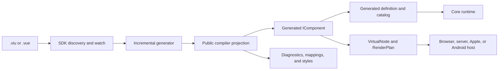

# Redesign Viu component abstractions

> I need help coming up with a new abstraction design for the viu project. Particularly regarding the Reactivity, Components, State, and the where they meet together, Core. Reactivity and State seem to be pretty sound but the Components abstraction, though somewhat solid, is starting to cross -boundaries that is requiring shims.
>
> Right now I'm in the middle of the API Hardening Plan and I am finding a quite a few cross-cutting concerns. I don't like adding interfaces or abstractions to be used as shims in order to bridge small dependency concerns across libraries. This seems to be what is increasing as I go through the API Hardening Plan.
>
> I don't exactly have a solution and I am a little lost, so I'll just lay out things I am not liking:
> 1. I don't like how IComponentContext and certain IComponent interfaces carry the same properties. The Components library should make up an abstraction that gives guidance on the composite structure of the virtual tree. Whether that is an HTML DOM or XML.
> 2. We have components implemented in Core which I feel should live in the Components library, particularly if they are out of the box.
> 3. I don't like how IComponentHotReloadMetadata is public there has got to be a better way if exposing this.
> 4. I don't like how we have this Assimalign.Viu.Shared as it seems not needed
> 5. I don't like how the Component library is not generic enough to account for server rendering which, or more so, requires a shim
> 6. Tooling APIs should be public, and I think that is accounted for in the API Hardening task.
>
> These are not all the items, but it's enough to start with.
>
> Can you try to come up with a better design/abstraction. When I started this project I wanted to replicate the viu.js hierarchal tree structure where state change only renders changes at tree block in which it occurred, not have to look at the entire DOM.

<details><summary>13 previous messages</summary>

> I’m going to treat this as an architecture investigation, not an implementation request. I’ll first recover the relevant prior Viu decisions, then map the full repository—especially `docs/SPECIFICATION.md`, the API Hardening plan, dependency edges, and the Reactivity/State/Components/Core/SSR/tooling contracts—before proposing a concrete ownership and tree-lifetime model.
>
> <details><summary>Ran 4 commands</summary>
>
> - Ran `rg -n -i "component-model|IComponent|reactivity|state|Core|Shared|API Hardening|NET-RESHAPE|shim" "C:\Users\chase\.codex\memories\MEMORY.md"`
> - Ran `git status --short --branch; rg --files -g '!all/**' -g '!nupkg/**' -g '!_out/**' -g '!**/bin/**' -g '!**/obj/**' | Measure-Object | Select-Object -ExpandProperty Count; Get-ChildItem -Force | Select-Object Mode,Name`
> - Ran `$lines = Get-Content 'C:\Users\chase\.codex\memories\MEMORY.md'; for ($i = 232; $i -le 270; $i++) { '{0}:{1}' -f ($i + 1), $lines[$i] }`
> - Ran `Get-Content 'C:\Users\chase\.codex\memories\rollout_summaries\2026-07-23T13-53-02-CQoW-viu_release_pipeline_and_abstraction_analysis.md'`
>
> </details>
>
> The prior redesign notes are relevant but explicitly unfinished: they warn that “component definition,” “rendered virtual node,” and “live component instance” were being conflated. I’m carrying that forward as a diagnostic hypothesis only, and I’m keeping this turn read-only until you approve a design. I’m now splitting the repository review into three parallel traces while I build the dependency graph and read the governing specification locally.
>
> <details><summary>Ran 14 commands</summary>
>
> - Ran `rg --files docs .designing libraries tooling analyzers frameworks sdks benchmarks | rg -i "(specification|hardening|reshape|design|adr|component|reactiv|state|server|render|shared|virtual|hotreload|shim)"`
> - Ran `rg -n --glob '*.csproj' --glob '*.props' --glob '*.targets' "Viu(Project|PrivateProject|Analyzer)Reference|ProjectReference" libraries tooling analyzers frameworks sdks`
> - Ran `rg -n -i "API Hardening|hardening plan|API-HARDENING|IComponentContext|IComponentHotReloadMetadata|shim|Assimalign\.Viu\.Shared" docs libraries tooling analyzers frameworks sdks .designing`
> - Ran `$projects = Get-ChildItem -Path libraries,tooling,analyzers,frameworks,sdks -Recurse -Filter *.csproj | Sort-Object FullName; foreach ($project in $projects) { [xml]$xml = Get-Content -LiteralPath $project.FullName; $refs = @(); foreach ($group in $xml.Project.ItemGroup) { foreach ($name in 'ViuProjectReference','ViuPrivateProjectReference','ViuAnalyzerReference','ProjectReference') { foreach ($item in @($group.$name)) { if ($null -ne $item -and $null -ne $item.Include) { $refs += ('{0}:{1}' -f $name,$item.Include) } } } }; if ($refs.Count -gt 0) { '{0} -> {1}' -f ($project.FullName.Replace((Get-Location).Path + '\','')), ($refs -join ', ') } }`
> - Ran ``$files = @('docs/SPECIFICATION.md','docs/API-HARDENING-PLAN.md','docs/NET-RESHAPE-PLAN.md','docs/PLAN.md','docs/adr/0002-ref-first-reactivity.md','docs/adr/0004-composition-only-component-model.md','libraries/Assimalign.Viu.Components/docs/OVERVIEW.md','libraries/Assimalign.Viu.Components/docs/DESIGN.md','libraries/Assimalign.Viu.Core/docs/OVERVIEW.md','libraries/Assimalign.Viu.Core/docs/DESIGN.md','libraries/Assimalign.Viu.Reactivity/docs/OVERVIEW.md','libraries/Assimalign.Viu.Reactivity/docs/DESIGN.md','libraries/Assimalign.Viu.State/docs/OVERVIEW.md','libraries/Assimalign.Viu.State/docs/DESIGN.md','libraries/Assimalign.Viu.ServerRenderer/docs/OVERVIEW.md','libraries/Assimalign.Viu.ServerRenderer/docs/DESIGN.md'); foreach ($file in $files) { if (Test-Path $file) { $count=(Get-Content $file).Count; "`n### $file ($count lines)"; rg -n '^#{1,4} ' $file } else { "`n### MISSING $file" } }``
> - Ran `$lines = Get-Content 'docs/SPECIFICATION.md'; for ($i = 0; $i -le 487; $i++) { '{0}:{1}' -f ($i + 1), $lines[$i] }`
> - Ran `$lines = Get-Content 'docs/SPECIFICATION.md'; for ($i = 487; $i -le 953; $i++) { '{0}:{1}' -f ($i + 1), $lines[$i] }`
> - Ran `$lines = Get-Content 'docs/SPECIFICATION.md'; for ($i = 1316; $i -le 1580; $i++) { '{0}:{1}' -f ($i + 1), $lines[$i] }`
> - Ran `$lines = Get-Content 'docs/API-HARDENING-PLAN.md'; for ($i = 0; $i -le 310; $i++) { '{0}:{1}' -f ($i + 1), $lines[$i] }`
> - Ran `$lines = Get-Content 'docs/API-HARDENING-PLAN.md'; for ($i = 310; $i -lt $lines.Count; $i++) { '{0}:{1}' -f ($i + 1), $lines[$i] }`
> - Ran `Get-ChildItem -Path 'libraries/Assimalign.Viu.Shared/src','libraries/Assimalign.Viu.State/src','libraries/Assimalign.Viu.ServerRenderer/src' -Recurse -File | Where-Object { $_.Extension -in '.cs','.csproj','.txt' } | ForEach-Object { $_.FullName.Replace((Get-Location).Path + '\','') } | Sort-Object`
> - Ran `Get-ChildItem -Path 'libraries/Assimalign.Viu.Core/src' -Recurse -File | Where-Object { $_.Extension -in '.cs','.csproj','.txt' } | ForEach-Object { $_.FullName.Replace((Get-Location).Path + '\','') } | Sort-Object`
> - Ran `Get-ChildItem -Path 'libraries/Assimalign.Viu.Components/src' -Recurse -File | Where-Object { $_.Extension -in '.cs','.csproj','.txt' } | ForEach-Object { $_.FullName.Replace((Get-Location).Path + '\','') } | Sort-Object`
> - Ran ``$files = @('libraries/Assimalign.Viu.Components/src/Abstraction/IComponent.cs','libraries/Assimalign.Viu.Components/src/Abstraction/IElementComponent.cs','libraries/Assimalign.Viu.Components/src/Abstraction/ITemplateComponent.cs','libraries/Assimalign.Viu.Components/src/Abstraction/ITextComponent.cs','libraries/Assimalign.Viu.Components/src/Abstraction/ICommentComponent.cs','libraries/Assimalign.Viu.Components/src/Abstraction/IStaticComponent.cs','libraries/Assimalign.Viu.Components/src/Abstraction/IFragmentComponent.cs','libraries/Assimalign.Viu.Components/src/Abstraction/ITeleportComponent.cs','libraries/Assimalign.Viu.Components/src/Abstraction/IComponentContext.cs','libraries/Assimalign.Viu.Components/src/Abstraction/IComponentTemplate.cs','libraries/Assimalign.Viu.Components/src/Abstraction/IComponentFactory.cs','libraries/Assimalign.Viu.Components/src/Abstraction/IComponentHotReloadMetadata.cs'); foreach ($file in $files) { "`n### $file"; $lines=Get-Content $file; for($i=0;$i -lt $lines.Count;$i++){ '{0}:{1}' -f ($i+1),$lines[$i] } }``
>
> </details>
>
> A concrete pressure point is already visible: the pending T05 plan proposes adding `Parent` and `ScopeIdentifier` to the author-facing `IComponentContext` solely because ServerRenderer and Testing currently reach into Core internals. That would make the interface larger to satisfy host inspection, not component authoring—the exact shim pattern you’re objecting to. I’m treating that part of the plan as suspect rather than assuming it should proceed.
>
> <details><summary>Ran 22 commands</summary>
>
> - Ran ``$types = @('PatchFlags','ShapeFlags','SlotFlags','PatchFlagNames','DomKnowledge','DisplayStringFormatter','LooseEquality','NameNormalization','NumberCoercion','StyleAndClassNormalization'); foreach ($type in $types) { "`n### $type"; rg -l --glob '*.cs' --glob '*.csproj' "\b$type\b" libraries tooling analyzers sdks frameworks benchmarks | Where-Object { $_ -notmatch '\\obj\\' } | ForEach-Object { ($_ -split '\\')[0..([Math]::Min(2,(($_ -split '\\').Count-1)))] -join '\' } | Sort-Object -Unique }``
> - Ran ``$files=@('libraries/Assimalign.Viu.Core/src/Rendering/RendererOptions{TNode}.cs','libraries/Assimalign.Viu.Components/src/Tree/ElementComponent.cs','libraries/Assimalign.Viu.Components/src/Attributes/ComponentAttributes.cs','libraries/Assimalign.Viu.Components/src/Abstraction/IComponentAttribute.cs','libraries/Assimalign.Viu.Components/src/Abstraction/IComponentAttributeCollection.cs','libraries/Assimalign.Viu.Components/src/Tree/TemplateComponent.cs','libraries/Assimalign.Viu.Components/src/ComponentTree.cs','libraries/Assimalign.Viu.Components/src/Optimization/ComponentOptimization.cs'); foreach($file in $files){"`n### $file";$lines=Get-Content $file;for($i=0;$i -lt $lines.Count;$i++){'{0}:{1}' -f ($i+1),$lines[$i]}}``
> - Ran ``$files=@('libraries/Assimalign.Viu.Core/src/KeepAlive/KeepAlive.cs','libraries/Assimalign.Viu.Core/src/Suspense/Suspense.cs','libraries/Assimalign.Viu.Core/src/Transitions/BaseTransition.cs','libraries/Assimalign.Viu.Core/src/Internal/IComponentRootBehaviorForwarder.cs','libraries/Assimalign.Viu.Core/src/Internal/TransitionComponents.cs','libraries/Assimalign.Viu.Core/src/Internal/SuspenseBoundaryContext.cs','libraries/Assimalign.Viu.Core/src/Internal/AsynchronousComponentTemplate.cs','libraries/Assimalign.Viu.Core/src/DynamicComponents/DynamicComponents.cs','libraries/Assimalign.Viu.Core/src/AsynchronousComponents/AsynchronousComponents.cs'); foreach($file in $files){"`n### $file";$lines=Get-Content $file;for($i=0;$i -lt $lines.Count;$i++){'{0}:{1}' -f ($i+1),$lines[$i]}}``
> - Ran ``$files=@('libraries/Assimalign.Viu.Core/src/Internal/IComponentRootBehaviorForwarder.cs','libraries/Assimalign.Viu.Core/src/Internal/TransitionComponents.cs','libraries/Assimalign.Viu.Core/src/Internal/ComponentContext.cs','libraries/Assimalign.Viu.Core/src/Internal/MountedComponent.cs'); foreach($file in $files){"`n### $file";$lines=Get-Content $file;for($i=0;$i -lt $lines.Count;$i++){'{0}:{1}' -f ($i+1),$lines[$i]}}``
> - Ran `rg -n "KeepAlive|Suspense|BaseTransition|IComponentRootBehaviorForwarder|ITransitionedComponent|TemplateType" 'libraries/Assimalign.Viu.Core/src/Rendering' 'libraries/Assimalign.Viu.Core/src/Internal/MountedComponent.cs'`
> - Ran `rg -n "CreateElement\(|ResolveNamespace|namespace|svg|math" 'libraries/Assimalign.Viu.Core/src/Rendering/Renderer{TNode}.cs' | Select-Object -First 100`
> - Ran `$lines=Get-Content 'libraries/Assimalign.Viu.Core/src/Rendering/Renderer{TNode}.cs'; for($i=340;$i -le 420;$i++){'{0}:{1}' -f ($i+1),$lines[$i]}; for($i=3165;$i -le 3210;$i++){'{0}:{1}' -f ($i+1),$lines[$i]}`
> - Ran ``$files=@('libraries/Assimalign.Viu.ServerRenderer/src/Internal/ServerComponentRenderer.cs','libraries/Assimalign.Viu.ServerRenderer/src/Internal/ComponentTreeSerializer.cs','libraries/Assimalign.Viu.ServerRenderer/src/SsrRenderState.cs','libraries/Assimalign.Viu.ServerRenderer/src/ServerRenderer.cs','libraries/Assimalign.Viu.ServerRenderer/src/Properties/AssemblyInfo.cs','libraries/Assimalign.Viu.Core/src/Properties/AssemblyInfo.cs'); foreach($file in $files){"`n### $file";$lines=Get-Content $file;for($i=0;$i -lt $lines.Count;$i++){'{0}:{1}' -f ($i+1),$lines[$i]}}``
> - Ran ``$files=@('libraries/Assimalign.Viu.Components/docs/OVERVIEW.md','libraries/Assimalign.Viu.Core/docs/OVERVIEW.md','libraries/Assimalign.Viu.State/docs/DESIGN.md','libraries/Assimalign.Viu.ServerRenderer/docs/DESIGN.md','docs/adr/0004-composition-only-component-model.md'); foreach($file in $files){"`n### $file";$lines=Get-Content $file;for($i=0;$i -lt $lines.Count;$i++){'{0}:{1}' -f ($i+1),$lines[$i]}}``
> - Ran `$lines=Get-Content 'docs/NET-RESHAPE-PLAN.md'; for($i=0;$i -lt $lines.Count;$i++){'{0}:{1}' -f ($i+1),$lines[$i]}`
> - Ran `rg -n -C 4 "IComponentHotReloadMetadata|ComponentIdentifier|TemplateUpdateMarkerType|ScriptUpdateMarkerType|StyleUpdateMarkerType" analyzers tooling libraries | Where-Object { $_ -notmatch '\\obj\\' }`
> - Ran ``$files=@('analyzers/Assimalign.Viu.Generators.Syntax/src/Internal/SingleFileComponentHotReloadHandlerEmitter.cs','tooling/Assimalign.Viu.Compiler.SingleFileComponent/src/Internal/SingleFileComponentSourceEmitter.cs'); foreach($file in $files){"`n### $file"; rg -n -C 6 "IComponentHotReloadMetadata|MetadataUpdate|HotReload|UpdateApplication" $file}``
> - Ran ``$files=@('libraries/Assimalign.Viu.State/src/Abstraction/IStateStoreContext.cs','libraries/Assimalign.Viu.State/src/StateStoreDefinition{TStore}.cs','libraries/Assimalign.Viu.State/src/StateStores.cs','libraries/Assimalign.Viu.Core/src/Abstraction/IComponentWarningContext.cs'); foreach($file in $files){"`n### $file";$lines=Get-Content $file;for($i=0;$i -lt $lines.Count;$i++){'{0}:{1}' -f ($i+1),$lines[$i]}}``
> - Ran `rg -n "IComponentWarningContext|IStateStoreContext|IComponentRootBehaviorForwarder|IComponentContext" libraries --glob '*.cs' | Where-Object { $_ -notmatch '\\test\\|\\obj\\' }`
> - Ran `$lines=Get-Content 'libraries/Assimalign.Viu.ServerRenderer/src/ServerRender.cs'; for($i=250;$i -le 500;$i++){'{0}:{1}' -f ($i+1),$lines[$i]}`
> - Ran `rg -n "InternalsVisibleTo" libraries tooling analyzers extensions --glob 'AssemblyInfo.cs' --glob '*.csproj' | Where-Object { $_ -notmatch '\\obj\\' }`
> - Ran `$lines=Get-Content 'libraries/Assimalign.Viu.Core/src/Rendering/Renderer{TNode}.cs'; for($i=540;$i -le 840;$i++){'{0}:{1}' -f ($i+1),$lines[$i]}`
> - Ran `$lines=Get-Content 'libraries/Assimalign.Viu.Core/src/Rendering/Renderer{TNode}.cs'; for($i=824;$i -le 930;$i++){'{0}:{1}' -f ($i+1),$lines[$i]}; rg -n "TryPatchBlockChildren|DynamicChildren" 'libraries/Assimalign.Viu.Core/src/Rendering/Renderer{TNode}.cs'`
> - Ran `rg -n -C 4 "_openBlock|_createElementBlock|_createElementVNode|BlockToken|DynamicChildren|block" 'libraries/Assimalign.Viu.Core/src/RenderHelpers.cs' 'libraries/Assimalign.Viu.Core/src/BlockToken.cs' | Select-Object -First 300`
> - Ran `rg -n "\b(ApplicationState|ComponentContext|MountedComponent|MountedTemplateNode|EmptyComponentFactory|EmptyServiceProvider)\b" libraries/Assimalign.Viu.Browser/src libraries/Assimalign.Viu.Testing/src libraries/Assimalign.Viu.ServerRenderer/src --glob '*.cs'`
> - Ran ``$files=@('libraries/Assimalign.Viu.State/src/Abstraction/IStateContext.cs','libraries/Assimalign.Viu.State/src/Internal/StateContext.cs','libraries/Assimalign.Viu.State/src/StateStoreRegistry.cs'); foreach($file in $files){"`n### $file";$lines=Get-Content $file;for($i=0;$i -lt $lines.Count;$i++){'{0}:{1}' -f ($i+1),$lines[$i]}}``
> - Ran `rg -n "\.Owner\b|\.Components\b" libraries/Assimalign.Viu.State libraries/Assimalign.Viu.Core libraries/Assimalign.Viu.Router --glob '*.cs' | Where-Object { $_ -notmatch '\\obj\\|PublicAPI' }`
>
> </details>
>
> The Reactivity/State trace confirms the core rendering behavior is sound: a reactive read subscribes the mounted component’s render effect, and block metadata then patches only the dynamic descendants of that component subtree. It also confirms one important boundary correction: State can become a Reactivity-only package; its current `IStateStoreContext`, component owner, and component-factory members are UI bridges with no production need outside Core integration.
>
> <details><summary>Ran a command</summary>
>
> - Ran ``$files=@('libraries/Assimalign.Viu.Components/src/Activation/ComponentRegistration.cs','libraries/Assimalign.Viu.Components/src/Activation/ComponentFactory.cs','libraries/Assimalign.Viu.Components/src/Delegates/ComponentActivator.cs','libraries/Assimalign.Viu.Core/src/Components/ComponentHotReload.cs','libraries/Assimalign.Viu.Core/src/Internal/ComponentHotReloadRegistration.cs'); foreach($file in $files){"`n### $file";$lines=Get-Content $file;for($i=0;$i -lt $lines.Count;$i++){'{0}:{1}' -f ($i+1),$lines[$i]}}``
>
> </details>
>
> <details><summary>Ran 2 commands</summary>
>
> - Ran `$lines=Get-Content 'libraries/Assimalign.Viu.Testing/src/Wrappers/ComponentWrapper.cs'; for($i=0;$i -le 180;$i++){'{0}:{1}' -f ($i+1),$lines[$i]}; for($i=280;$i -le 330;$i++){'{0}:{1}' -f ($i+1),$lines[$i]}`
> - Ran ``$files=@('libraries/Assimalign.Viu.Core/src/Rendering/Renderer.ComponentHost.cs','libraries/Assimalign.Viu.Core/src/Rendering/ComponentHost.cs'); foreach($file in $files){"`n### $file";$lines=Get-Content $file;for($i=0;$i -lt $lines.Count;$i++){'{0}:{1}' -f ($i+1),$lines[$i]}}``
>
> </details>
>
> Context compaction
>
> Source: automatic
> Status: completed
>
> I’ve reached the core conclusion: the pressure is coming from four lifetimes being represented as variations of “component.” I’m checking the last traces now, then I’ll give you a concrete target model and an order that avoids turning T05 into another compatibility layer.
>
> <details><summary>Ran 2 commands</summary>
>
> - Ran `$registry='C:\Users\chase\.codex\memories\MEMORY.md'; $rollout='C:\Users\chase\.codex\memories\rollout_summaries\2026-07-23T13-53-02-CQoW-viu_release_pipeline_and_abstraction_analysis.md'; $i=0; Get-Content -LiteralPath $registry | ForEach-Object { $i++; if ($i -ge 233 -and $i -le 256) { '{0}:{1}' -f $i,$_ } }; $j=0; Get-Content -LiteralPath $rollout | ForEach-Object { $j++; if ($j -ge 1 -and $j -le 40) { '{0}:{1}' -f $j,$_ } }`
> - Ran `git status --short --branch`
>
> </details>
>
> <details><summary>Plan</summary>
>
> Completed the read-only repository and prior-design review, traced each cross-library seam, and consolidated the findings into a target architecture and migration sequence.
>
> - [x] Review prior design decisions and current project dependency shape
> - [x] Trace Components, Core, Reactivity, State, SSR, Testing, and tooling shim paths
> - [x] Design replacement ownership boundaries and runtime operations
> - [x] Deliver the proposed model, migration order, and remaining design choices
>
> </details>
</details>

I would pause the runtime-facing part of T05. The project does not need more bridge interfaces; it needs the different meanings of “component” separated.

The clean boundary is:



The specification already distinguishes rendered descriptions, authored behavior, and mounted bookkeeping, but the current type vocabulary blurs those roles ([SPECIFICATION.md](./docs/SPECIFICATION.md:199)). That is why `IComponentContext` has become the universal object that State, SSR, Testing, Suspense, and hot reload all try to reach through.

## The proposed model

### Components: immutable virtual-tree structure

Components should own a closed, host-neutral tree algebra:

```text
VirtualNode
├─ ElementNode
├─ TextNode
├─ CommentNode
├─ StaticNode
├─ FragmentNode
├─ ComponentNode
├─ TeleportNode
├─ KeepAliveNode
├─ SuspenseNode
└─ TransitionNode
```

Use a public opaque abstract base with sealed concrete variants, not `ComponentKind` plus a matching interface. The current design permits an object to report `Element` while not implementing `IElementComponent`, forcing both Core and SSR to switch and cast defensively.

`CompositeVirtualNode` can provide the structural guidance you are looking for, but it should not force every node to expose `Children`. Elements and fragments are ordinary composites; components own slot trees; Suspense owns content and fallback branches; Teleport owns content plus a target.

For HTML/XML neutrality, replace flat tag and attribute names with structured values:

```text
QualifiedName
- LocalName
- NamespaceUri
- Prefix, when preservation matters
```

Bindings should also distinguish attributes, properties, events, directives, and node lifecycle behavior. XML has attributes but no DOM properties, so those cannot remain one ambiguous string/object collection.

Core currently contains SVG/MathML/`foreignObject` name rules despite being generic over `TNode` ([Renderer{TNode}.cs](<./libraries/Assimalign.Viu.Core/src/Rendering/Renderer{TNode}.cs:3183>)). Those rules should be lowered by the HTML compiler or supplied by an HTML host policy.

### Separate the four component lifetimes

| Lifetime | Proposed type | Owner |
|---|---|---|
| Immutable tree request | `ComponentNode` + `ComponentInvocation` | Components |
| Static identity/input schema | `ComponentReference` + `ComponentContract` | Components |
| Activation and live authored instance | `ComponentDefinition`, `IComponent`, `ComponentContext` | Core |
| Mounted runtime bookkeeping | `MountedComponent<TNode>` | Core, internal |

`ComponentDefinition` would associate the structural reference with an AOT-safe activator and optional development metadata. No reflection-based activation is needed.

This also gives Core its proper meaning: it is where Components, Reactivity, and State intentionally meet.

## Addressing the six concerns

1. **Repeated context properties**

The properties are similar, but they currently represent different stages:

- `ITemplateComponent.Arguments` and `Slots` are the immutable raw parent request.
- `IComponentContext.Arguments`, `Slots`, and `Attributes` are normalized live bindings after parameter matching, defaults, listener consumption, and fallthrough processing.

Core performs that normalization today in [ComponentContext.cs](./libraries/Assimalign.Viu.Core/src/Internal/ComponentContext.cs:226).

Do not introduce a shared bag interface. Make the distinction explicit:

```text
ComponentInvocation
- Arguments
- Slots
- Listeners
- Directives

ComponentBindings
- Parameters
- EffectiveSlots
- FallthroughAttributes
```

Then expose one `Bindings` property from a runtime-owned `ComponentContext`.

I would make `ComponentContext` a sealed Core-provided type rather than another independently implementable interface. In practice, SSR and built-ins already reject non-Core implementations through downcasts.

Do not put `Parent`, `ScopeIdentifier`, host ranges, or mounted state on it:

- Scope belongs to `ComponentContract`.
- Parent and host ranges belong to mounted diagnostics.
- State integration is legitimate in Core because Core references State.

2. **Built-ins in Core**

Do not move the existing classes wholesale. KeepAlive, Suspense, and transitions are not ordinary authored components; they alter mounting, caching, scheduling, or host behavior. Core already special-cases them during activation and rendering ([MountedComponent.cs](./libraries/Assimalign.Viu.Core/src/Internal/MountedComponent.cs:84)).

Split them by role:

- Components owns `KeepAliveNode`, `SuspenseNode`, and `TransitionNode`, plus their public configuration.
- Core owns their internal executors and mounted state.
- Browser owns CSS-transition host behavior.

That removes hidden type/name tests without creating a Components → Core cycle.

3. **Public hot-reload interface**

Some public compiler/runtime ABI is unavoidable because generated code lives in consumer assemblies and reflection is forbidden. But it should not be an author-facing interface implemented by every generated component.

Replace `IComponentHotReloadMetadata` with generated registration:

```csharp
ComponentCompilerServices.Register(
    componentType,
    componentReference,
    developmentMetadata);
```

The compiler can emit this through static/module registration. Core stores the metadata against the component definition. Keep the registration API public but `[EditorBrowsable(EditorBrowsableState.Never)]`; it is an explicit generated-code ABI, not part of the component abstraction.

4. **Assimalign.Viu.Shared**

I agree it should disappear. It is an ownership bucket, not a domain.

- `PatchFlags`, slot stability, and component-name normalization → Components.
- `PatchFlagNames` → tooling.
- Unused `ShapeFlags` and extensions → delete after characterization.
- Loose equality and number coercion → Browser.
- HTML/SVG/MathML knowledge → Browser, ServerRenderer, and the HTML compiler—or a focused `Assimalign.Viu.Html` package if they truly need one shared implementation.
- Display/class/style normalization → whichever markup policy owns those semantics.

Do not replace Shared with `Abstractions` or another miscellaneous package.

5. **Server rendering**

SSR already consumes the same virtual tree. Its problem is component execution access: it currently downcasts `IComponentContext` and manually drives internal `MountedComponent` under `InternalsVisibleTo` ([ServerComponentRenderer.cs](./libraries/Assimalign.Viu.ServerRenderer/src/Internal/ServerComponentRenderer.cs:19), [AssemblyInfo.cs](./libraries/Assimalign.Viu.Core/src/Properties/AssemblyInfo.cs:3)).

Core should expose an operation, not another runtime interface:

```text
ComponentRuntime.RenderOnceAsync(...)
    -> ComponentRenderLease : IAsyncDisposable
```

The lease encapsulates activation, setup, server prefetch, one render, error propagation, cancellation, abort, and cleanup. Persistent browser rendering and one-shot server rendering then use the same Core component runtime.

Testing similarly needs a designed `MountedComponentSnapshot<TNode>` containing definition, invocation, instance/type, context, parent identity, and first/last host nodes. The proposed T05 view is currently too narrow; Testing uses more than just context and the host range ([ComponentWrapper.cs](./libraries/Assimalign.Viu.Testing/src/Wrappers/ComponentWrapper.cs:20)).

6. **Tooling APIs**

Make actual cross-tooling contracts public, but do not promote the entire internal representation graph.

Expose one stable projection operation with public request/result models:

- source text, path, and compilation options;
- generated source and hint name;
- host-neutral diagnostics;
- projection/source-map manifest.

Generators and the language service should consume the same operation. Intermediate compiler nodes remain internal. Public accessibility does not require putting those tooling assemblies into application reference packs or IntelliSense.

## Reactivity and State

Reactivity is fundamentally in the right place. Keep it a leaf and retain `IReactiveWatchScheduler`; that interface represents real variation between standalone, Core, and test scheduling policies.

State should depend only on Reactivity. Its component-aware convenience belongs in Core.

In particular, remove `IStateStoreContext`. It explicitly exists to make State recognize a hidden Core capability through a cast ([IStateStoreContext.cs](./libraries/Assimalign.Viu.State/src/Abstraction/IStateStoreContext.cs:3)). Also remove `IStateContext.Components` and its component owner unless a real production use is established.

A Core-owned `ComponentContext` can resolve state stores directly while preserving State’s registry and ownership semantics.

## Your block-level rendering goal

The current runtime already avoids revisiting the entire application tree:

1. A mounted authored component owns one reactive render effect.
2. Only components whose render read the changed reactive value are scheduled.
3. That component’s render closure produces a fresh subtree.
4. Compatible compiler blocks patch only their recorded dynamic descendants.

This is implemented around [Renderer{TNode}.cs](<./libraries/Assimalign.Viu.Core/src/Rendering/Renderer{TNode}.cs:566>) and specified by the block rules in [SPECIFICATION.md](./docs/SPECIFICATION.md:622).

The important distinction is: **blocks are currently patch units, not reactive subscriber units**. The affected component’s full render closure still re-executes.

If you want only the expression block containing the reactive read to re-execute, that is a separate compiler/runtime design involving per-block closures, effects, scheduler jobs, ownership, and teardown. I would preserve today’s component-effect plus block-local patching model during this boundary redesign and benchmark block-owned effects separately.

## What I would do with T05

Pause these proposed changes:

- Adding `Parent` or `ScopeIdentifier` to `IComponentContext`.
- Finalizing the currently proposed mounted-template view.
- Unsealing or publicly widening runtime types merely to satisfy SSR/Testing.
- Adding any new marker/capability interfaces.

Mechanical work can continue: zero-consumer removals, test-only friend access, and deliberate tooling API promotion.

Then migrate in this order:

1. Add characterization tests for render run counts, block visits, scheduler ordering, SSR lifecycle/output, Testing queries, and hot-reload registration.
2. Amend the specification with the four lifetime roles and host-neutral tree requirements.
3. Introduce the closed virtual-node algebra and qualified names.
4. Introduce Core-owned definitions, contexts, and render leases.
5. Decouple State and replace SSR/Testing friend access with operations and snapshots.
6. Convert built-ins to structural nodes and move hot reload to generated registration.
7. Relocate Shared contents and publish the tooling facade.
8. Remove the old model atomically—no public compatibility shim layer.

No files were changed and no tests were run; this was a read-only architecture investigation. The prior redesign notes were used only as an unapproved guardrail. If you agree with this boundary, the next useful artifact would be an isolated `.redesign/COMPONENT-RUNTIME-V2.md` with exact candidate contracts and a clause-by-clause specification migration.

> Okay I like this design. Before we begin could you generate the end abstraction/design in a temp folder of the repo. Replicate the project structure like in the repo. I just need to understand the end result

<details><summary>11 previous messages</summary>

> I’ll build this as an isolated, end-state reference implementation under `.redesign`, mirroring the relevant `libraries/.../{src,test}` and `tooling/.../{src,test}` layout. I’ll keep it out of the shipping solution and make the contracts coherent enough to inspect—and, if the repo’s build resolver permits it safely, compile independently.
>
> <details><summary>Ran 8 commands</summary>
>
> - Ran `$ErrorActionPreference='Stop'; Get-ChildItem -Force -Name; if (Test-Path -LiteralPath '.redesign') { Get-ChildItem -LiteralPath '.redesign' -Force -Recurse | Select-Object -First 100 -ExpandProperty FullName }; rg -n "ViuProjectReference|ViuRepository|RepositoryRoot|Indexed" build Directory.Build.props Directory.Build.targets -g "*.props" -g "*.targets"`
> - Ran `$ErrorActionPreference='Stop'; if (Test-Path -LiteralPath '.designing') { Get-ChildItem -LiteralPath '.designing' -Force -Recurse | Select-Object FullName,Length | Format-Table -AutoSize }; rg -n "designing|redesign|temp" .gitignore AGENTS.md docs -g "*.md" -g ".gitignore"`
> - Ran `git status --short --untracked-files=all; git ls-files .designing .redesign; git check-ignore -v .designing .designing/SampleApp/Program.cs .redesign 2>$null`
> - Ran `$files=@('Directory.Build.props','Directory.Build.targets','build/Build.props','build/Build.targets','build/Targets/Build.References.Projects.targets','build/Targets/Build.Global.props','build/Targets/Build.References.Packages.targets'); foreach($file in $files){ Write-Output ('### '+$file); Get-Content -LiteralPath $file -TotalCount 180 }`
> - Ran `Get-Content -LiteralPath 'Assimalign.Viu.slnx' -TotalCount 80; Get-Content -LiteralPath 'libraries/Assimalign.Viu.Components/src/Assimalign.Viu.Components.csproj'; Get-Content -LiteralPath 'libraries/Assimalign.Viu.Components/test/Assimalign.Viu.Components.Tests.csproj'`
> - Ran `dotnet --version; Get-Content -LiteralPath 'global.json'; Get-Content -LiteralPath 'build/Targets/Build.TargetFramework.props' -TotalCount 120`
> - Ran `$projects=@('Assimalign.Viu.Components','Assimalign.Viu.Reactivity','Assimalign.Viu.State','Assimalign.Viu.Core','Assimalign.Viu.Browser','Assimalign.Viu.ServerRenderer','Assimalign.Viu.Testing'); foreach($project in $projects){ Write-Output ('### '+$project); $path=Join-Path 'libraries' $project; Get-ChildItem -LiteralPath $path -Directory | Select-Object -ExpandProperty Name; Get-ChildItem -LiteralPath (Join-Path $path 'src') -Directory -ErrorAction SilentlyContinue | Select-Object -ExpandProperty Name }`
> - Ran `Get-Content -LiteralPath 'libraries/Assimalign.Viu.Components/src/Abstraction/IComponentTemplate.cs'; Get-Content -LiteralPath 'libraries/Assimalign.Viu.Components/src/Delegates/ComponentSetup.cs' -ErrorAction SilentlyContinue; rg -n "delegate.*Component|ServerPrefetch|OnServer" libraries/Assimalign.Viu.Components/src libraries/Assimalign.Viu.Core/src -g "*.cs"`
>
> </details>
>
> The isolated build strategy is settled. I found an existing tracked `.designing` sample area, so I’m leaving that untouched and using a new `.redesign` graph. Its local by-name resolver will fail closed, preventing the design projects from accidentally compiling against today’s shipping projects with the same assembly names.
>
> <details><summary>Created 45 files, ran a command</summary>
>
> - Wrote `./.redesign/Assimalign.Viu.Redesign.slnx` (+50 -0)
> - Wrote `./.redesign/Directory.Build.props` (+13 -0)
> - Wrote `./.redesign/Directory.Build.targets` (+4 -0)
> - Wrote `./.redesign/README.md` (+49 -0)
> - Wrote `./.redesign/build/Build.References.Projects.targets` (+44 -0)
> - Wrote `./.redesign/docs/END-STATE.md` (+121 -0)
> - Wrote `./.redesign/docs/PROJECT-GRAPH.md` (+40 -0)
> - Wrote `./.redesign/docs/TYPE-MAP.md` (+20 -0)
> - Wrote `./.redesign/libraries/Assimalign.Viu.Browser/src/Assimalign.Viu.Browser.csproj` (+10 -0)
> - Wrote `./.redesign/libraries/Assimalign.Viu.Components/src/Assimalign.Viu.Components.csproj` (+6 -0)
> - Wrote `./.redesign/libraries/Assimalign.Viu.Core/src/Assimalign.Viu.Core.csproj` (+12 -0)
> - Wrote `./.redesign/libraries/Assimalign.Viu.Reactivity/src/Assimalign.Viu.Reactivity.csproj` (+6 -0)
> - Wrote `./.redesign/libraries/Assimalign.Viu.ServerRenderer/src/Assimalign.Viu.ServerRenderer.csproj` (+10 -0)
> - Wrote `./.redesign/libraries/Assimalign.Viu.State/src/Assimalign.Viu.State.csproj` (+9 -0)
> - Wrote `./.redesign/libraries/Assimalign.Viu.Testing/src/Assimalign.Viu.Testing.csproj` (+10 -0)
> - Wrote `./.redesign/tooling/Assimalign.Viu.Compiler.SingleFileComponent/src/Assimalign.Viu.Compiler.SingleFileComponent.csproj` (+6 -0)
> - Ran `Get-ChildItem -LiteralPath '.redesign' -Recurse -File | Select-Object -ExpandProperty FullName`
> - Wrote `./.redesign/libraries/Assimalign.Viu.Components/src/Bindings/DirectiveInvocation.cs` (+25 -0)
> - Wrote `./.redesign/libraries/Assimalign.Viu.Components/src/Bindings/ElementBinding.cs` (+53 -0)
> - Wrote `./.redesign/libraries/Assimalign.Viu.Components/src/Bindings/ElementBindingKind.cs` (+16 -0)
> - Wrote `./.redesign/libraries/Assimalign.Viu.Components/src/Bindings/QualifiedName.cs` (+41 -0)
> - Wrote `./.redesign/libraries/Assimalign.Viu.Components/src/BuiltIns/KeepAliveNode.cs` (+38 -0)
> - Wrote `./.redesign/libraries/Assimalign.Viu.Components/src/BuiltIns/SuspenseNode.cs` (+27 -0)
> - Wrote `./.redesign/libraries/Assimalign.Viu.Components/src/BuiltIns/TransitionNode.cs` (+28 -0)
> - Wrote `./.redesign/libraries/Assimalign.Viu.Components/src/Components/ComponentContract.cs` (+44 -0)
> - Wrote `./.redesign/libraries/Assimalign.Viu.Components/src/Components/ComponentContractFlags.cs` (+16 -0)
> - Wrote `./.redesign/libraries/Assimalign.Viu.Components/src/Components/ComponentInvocation.cs` (+47 -0)
> - Wrote `./.redesign/libraries/Assimalign.Viu.Components/src/Components/ComponentReference.cs` (+46 -0)
> - Wrote `./.redesign/libraries/Assimalign.Viu.Components/src/Components/ComponentReferenceKind.cs` (+13 -0)
> - Wrote `./.redesign/libraries/Assimalign.Viu.Components/src/Delegates/ComponentEventListener.cs` (+9 -0)
> - Wrote `./.redesign/libraries/Assimalign.Viu.Components/src/Delegates/ComponentSlot.cs` (+10 -0)
> - Wrote `./.redesign/libraries/Assimalign.Viu.Components/src/Delegates/MountReference.cs` (+7 -0)
> - Wrote `./.redesign/libraries/Assimalign.Viu.Components/src/Internal/CollectionSnapshot.cs` (+31 -0)
> - Wrote `./.redesign/libraries/Assimalign.Viu.Components/src/Optimization/PatchFlags.cs` (+25 -0)
> - Wrote `./.redesign/libraries/Assimalign.Viu.Components/src/Optimization/RenderPlan.cs` (+44 -0)
> - Wrote `./.redesign/libraries/Assimalign.Viu.Components/src/Tree/CommentNode.cs` (+19 -0)
> - Wrote `./.redesign/libraries/Assimalign.Viu.Components/src/Tree/ComponentNode.cs` (+31 -0)
> - Wrote `./.redesign/libraries/Assimalign.Viu.Components/src/Tree/CompositeVirtualNode.cs` (+23 -0)
> - Wrote `./.redesign/libraries/Assimalign.Viu.Components/src/Tree/ElementNode.cs` (+34 -0)
> - Wrote `./.redesign/libraries/Assimalign.Viu.Components/src/Tree/FragmentNode.cs` (+19 -0)
> - Wrote `./.redesign/libraries/Assimalign.Viu.Components/src/Tree/MarkupFormat.cs` (+11 -0)
> - Wrote `./.redesign/libraries/Assimalign.Viu.Components/src/Tree/StaticNode.cs` (+26 -0)
> - Wrote `./.redesign/libraries/Assimalign.Viu.Components/src/Tree/TeleportNode.cs` (+27 -0)
> - Wrote `./.redesign/libraries/Assimalign.Viu.Components/src/Tree/TextNode.cs` (+24 -0)
> - Wrote `./.redesign/libraries/Assimalign.Viu.Components/src/VirtualNode.cs` (+35 -0)
> - Wrote `./.redesign/libraries/Assimalign.Viu.Components/src/VirtualNodeKind.cs` (+37 -0)
>
> </details>
>
> The structural layer is now laid out: a closed `VirtualNode` hierarchy, qualified names, explicit binding kinds, raw `ComponentInvocation`, compiler `RenderPlan`, and first-class KeepAlive/Suspense/Transition nodes. I’m building the Core/State seams next so the example shows the full request → live context → render lease flow, not just type names.
>
> <details><summary>Created 62 files, edited 10 files, ran a command</summary>
>
> - Wrote `./.redesign/libraries/Assimalign.Viu.Reactivity/src/Abstraction/IReactiveWatchScheduler.cs` (+15 -0)
> - Wrote `./.redesign/libraries/Assimalign.Viu.Reactivity/src/Effects/EffectScope.cs` (+45 -0)
> - Wrote `./.redesign/libraries/Assimalign.Viu.Reactivity/src/Watch/ImmediateWatchScheduler.cs` (+16 -0)
> - Wrote `./.redesign/libraries/Assimalign.Viu.Reactivity/src/Watch/WatchJob.cs` (+27 -0)
> - Wrote `./.redesign/libraries/Assimalign.Viu.Reactivity/src/docs/OVERVIEW.md` (+6 -0)
> - Wrote `./.redesign/libraries/Assimalign.Viu.State/src/Abstraction/IStateContext.cs` (+20 -0)
> - Wrote `./.redesign/libraries/Assimalign.Viu.State/src/Abstraction/IStateStoreRegistry.cs` (+29 -0)
> - Wrote `./.redesign/libraries/Assimalign.Viu.State/src/Delegates/StateStoreActivator{TStore}.cs` (+8 -0)
> - Wrote `./.redesign/libraries/Assimalign.Viu.State/src/Internal/StateContext.cs` (+24 -0)
> - Wrote `./.redesign/libraries/Assimalign.Viu.State/src/Internal/StateStoreRegistry.cs` (+110 -0)
> - Wrote `./.redesign/libraries/Assimalign.Viu.State/src/StateStoreDefinition{TStore}.cs` (+38 -0)
> - Wrote `./.redesign/libraries/Assimalign.Viu.State/src/StateStores.cs` (+22 -0)
> - Wrote `./.redesign/libraries/Assimalign.Viu.Components/src/Components/ComponentReference.cs` (+1 -1)
> - Wrote `./.redesign/libraries/Assimalign.Viu.Components/src/Tree/ComponentNode.cs` (+3 -0)
> - Wrote `./.redesign/libraries/Assimalign.Viu.Core/src/Abstraction/IComponent.cs` (+17 -0)
> - Wrote `./.redesign/libraries/Assimalign.Viu.Core/src/Abstraction/IComponentDefinitionResolver.cs` (+14 -0)
> - Wrote `./.redesign/libraries/Assimalign.Viu.Core/src/Abstraction/IVirtualNodeHost{TNode}.cs` (+44 -0)
> - Wrote `./.redesign/libraries/Assimalign.Viu.Core/src/Components/ComponentBindings.cs` (+60 -0)
> - Wrote `./.redesign/libraries/Assimalign.Viu.Core/src/Components/ComponentCompilerServices.cs` (+32 -0)
> - Wrote `./.redesign/libraries/Assimalign.Viu.Core/src/Components/ComponentContext.cs` (+91 -0)
> - Wrote `./.redesign/libraries/Assimalign.Viu.Core/src/Components/ComponentDefinition.cs` (+46 -0)
> - Wrote `./.redesign/libraries/Assimalign.Viu.Core/src/Components/ComponentDevelopmentMetadata.cs` (+32 -0)
> - Wrote `./.redesign/libraries/Assimalign.Viu.Core/src/Components/ComponentLifecycle.cs` (+51 -0)
> - Wrote `./.redesign/libraries/Assimalign.Viu.Core/src/Components/ComponentRegistry.cs` (+40 -0)
> - Wrote `./.redesign/libraries/Assimalign.Viu.Core/src/Delegates/ComponentActivator.cs` (+8 -0)
> - Wrote `./.redesign/libraries/Assimalign.Viu.Core/src/Delegates/ComponentRenderer.cs` (+7 -0)
> - Wrote `./.redesign/libraries/Assimalign.Viu.Core/src/Rendering/ComponentMountIdentifier.cs` (+7 -0)
> - Wrote `./.redesign/libraries/Assimalign.Viu.Core/src/Rendering/ComponentRenderLease.cs` (+92 -0)
> - Wrote `./.redesign/libraries/Assimalign.Viu.Core/src/Rendering/ComponentRenderRequest.cs` (+27 -0)
> - Wrote `./.redesign/libraries/Assimalign.Viu.Core/src/Rendering/ComponentRuntime.cs` (+76 -0)
> - Wrote `./.redesign/libraries/Assimalign.Viu.Core/src/Rendering/ComponentRuntimeOptions.cs` (+44 -0)
> - Wrote `./.redesign/libraries/Assimalign.Viu.Core/src/Rendering/MountedComponentSnapshot{TNode}.cs` (+67 -0)
> - Wrote `./.redesign/libraries/Assimalign.Viu.Browser/src/BrowserNodeHandle.cs` (+15 -0)
> - Wrote `./.redesign/libraries/Assimalign.Viu.Browser/src/BrowserVirtualNodeHost.cs` (+68 -0)
> - Wrote `./.redesign/libraries/Assimalign.Viu.ServerRenderer/src/Internal/ServerMarkupSerializer.cs` (+148 -0)
> - Wrote `./.redesign/libraries/Assimalign.Viu.ServerRenderer/src/ServerRenderer.cs` (+38 -0)
> - Wrote `./.redesign/libraries/Assimalign.Viu.Testing/src/Nodes/TestNode.cs` (+18 -0)
> - Wrote `./.redesign/libraries/Assimalign.Viu.Testing/src/Nodes/TestVirtualNodeHost.cs` (+105 -0)
> - Wrote `./.redesign/libraries/Assimalign.Viu.Testing/src/Wrappers/ComponentHarness.cs` (+39 -0)
> - Wrote `./.redesign/tooling/Assimalign.Viu.Compiler.SingleFileComponent/src/Diagnostics/SingleFileComponentDiagnostic.cs` (+47 -0)
> - Wrote `./.redesign/tooling/Assimalign.Viu.Compiler.SingleFileComponent/src/Diagnostics/SingleFileComponentDiagnosticSeverity.cs` (+14 -0)
> - Wrote `./.redesign/tooling/Assimalign.Viu.Compiler.SingleFileComponent/src/Internal/ProjectionPipeline.cs` (+55 -0)
> - Wrote `./.redesign/tooling/Assimalign.Viu.Compiler.SingleFileComponent/src/Projection/SingleFileComponentProjectionRequest.cs` (+59 -0)
> - Wrote `./.redesign/tooling/Assimalign.Viu.Compiler.SingleFileComponent/src/Projection/SingleFileComponentProjectionResult.cs` (+54 -0)
> - Wrote `./.redesign/tooling/Assimalign.Viu.Compiler.SingleFileComponent/src/SingleFileComponentCompiler.cs` (+26 -0)
> - Wrote `./.redesign/tooling/Assimalign.Viu.Compiler.SingleFileComponent/src/SingleFileComponentFormat.cs` (+11 -0)
> - Wrote `./.redesign/tooling/Assimalign.Viu.Compiler.SingleFileComponent/src/SourceMapping/SingleFileComponentSourceMapping.cs` (+24 -0)
> - Wrote `./.redesign/tooling/Assimalign.Viu.Compiler.SingleFileComponent/src/SourceMapping/SingleFileComponentSourceRange.cs` (+32 -0)
> - Wrote `./.redesign/libraries/Assimalign.Viu.Browser/test/Assimalign.Viu.Browser.Tests.csproj` (+15 -0)
> - Wrote `./.redesign/libraries/Assimalign.Viu.Browser/test/BrowserVirtualNodeHostTests.cs` (+20 -0)
> - Wrote `./.redesign/libraries/Assimalign.Viu.Components/test/Assimalign.Viu.Components.Tests.csproj` (+15 -0)
> - Wrote `./.redesign/libraries/Assimalign.Viu.Components/test/VirtualNodeContractTests.cs` (+39 -0)
> - Wrote `./.redesign/libraries/Assimalign.Viu.Core/test/Assimalign.Viu.Core.Tests.csproj` (+18 -0)
> - Wrote `./.redesign/libraries/Assimalign.Viu.Core/test/ComponentRuntimeTests.cs` (+49 -0)
> - Wrote `./.redesign/libraries/Assimalign.Viu.Reactivity/test/Assimalign.Viu.Reactivity.Tests.csproj` (+15 -0)
> - Wrote `./.redesign/libraries/Assimalign.Viu.Reactivity/test/WatchSchedulerTests.cs` (+21 -0)
> - Wrote `./.redesign/libraries/Assimalign.Viu.ServerRenderer/test/Assimalign.Viu.ServerRenderer.Tests.csproj` (+19 -0)
> - Wrote `./.redesign/libraries/Assimalign.Viu.ServerRenderer/test/ServerRendererTests.cs` (+47 -0)
> - Wrote `./.redesign/libraries/Assimalign.Viu.State/test/Assimalign.Viu.State.Tests.csproj` (+16 -0)
> - Wrote `./.redesign/libraries/Assimalign.Viu.State/test/StateStoreRegistryTests.cs` (+35 -0)
> - Wrote `./.redesign/libraries/Assimalign.Viu.Testing/test/Assimalign.Viu.Testing.Tests.csproj` (+16 -0)
> - Wrote `./.redesign/libraries/Assimalign.Viu.Testing/test/TestVirtualNodeHostTests.cs` (+26 -0)
> - Wrote `./.redesign/tooling/Assimalign.Viu.Compiler.SingleFileComponent/test/Assimalign.Viu.Compiler.SingleFileComponent.Tests.csproj` (+15 -0)
> - Wrote `./.redesign/tooling/Assimalign.Viu.Compiler.SingleFileComponent/test/SingleFileComponentCompilerTests.cs` (+28 -0)
> - Wrote `./.redesign/libraries/Assimalign.Viu.Browser/src/BrowserVirtualNodeHost.cs` (+1 -0)
> - Wrote `./.redesign/libraries/Assimalign.Viu.Components/src/Components/ComponentInvocation.cs` (+0 -1)
> - Wrote `./.redesign/libraries/Assimalign.Viu.Core/test/ComponentRuntimeTests.cs` (+1 -0)
> - Wrote `./.redesign/libraries/Assimalign.Viu.ServerRenderer/src/Internal/ServerMarkupSerializer.cs` (+1 -0)
> - Wrote `./.redesign/libraries/Assimalign.Viu.ServerRenderer/src/ServerRenderer.cs` (+1 -0)
> - Wrote `./.redesign/libraries/Assimalign.Viu.ServerRenderer/test/ServerRendererTests.cs` (+1 -0)
> - Wrote `./.redesign/libraries/Assimalign.Viu.Testing/src/Nodes/TestVirtualNodeHost.cs` (+1 -0)
> - Wrote `./.redesign/libraries/Assimalign.Viu.Testing/src/Wrappers/ComponentHarness.cs` (+2 -0)
> - Ran `dotnet msbuild .redesign/libraries/Assimalign.Viu.Core/src/Assimalign.Viu.Core.csproj -getItem:ProjectReference`
>
> </details>
>
> The first safety check did its job: the local resolver failed before compilation because one MSBuild metadata filter was invalid. I’m correcting that resolver now; I won’t proceed until its evaluated `ProjectReference` paths prove they all stay under `.redesign`.
>
> <details><summary>Edited 5 files, ran 6 commands</summary>
>
> - Wrote `./.redesign/build/Build.References.Projects.targets` (+8 -7)
> - Ran `dotnet msbuild .redesign/libraries/Assimalign.Viu.Core/src/Assimalign.Viu.Core.csproj -getItem:ProjectReference`
> - Ran `dotnet restore .redesign/Assimalign.Viu.Redesign.slnx`
> - Wrote `./.redesign/tooling/Assimalign.Viu.Compiler.SingleFileComponent/src/Assimalign.Viu.Compiler.SingleFileComponent.csproj` (+0 -1)
> - Ran `dotnet build .redesign/Assimalign.Viu.Redesign.slnx --no-restore -warnaserror`
> - Ran `rg -n "CollectionSnapshot\.Copy" .redesign/libraries/Assimalign.Viu.Components/src -g "*.cs"`
> - Wrote `./.redesign/libraries/Assimalign.Viu.Components/src/Components/ComponentInvocation.cs` (+5 -5)
> - Wrote `./.redesign/libraries/Assimalign.Viu.Components/src/Internal/CollectionSnapshot.cs` (+1 -1)
> - Ran `dotnet build .redesign/Assimalign.Viu.Redesign.slnx --no-restore -warnaserror`
> - Wrote `./.redesign/libraries/Assimalign.Viu.ServerRenderer/src/Internal/ServerMarkupSerializer.cs` (+4 -2)
> - Ran `dotnet build .redesign/Assimalign.Viu.Redesign.slnx --no-restore -warnaserror`
>
> </details>
>
> The entire isolated graph now builds with 0 warnings and 0 errors. The end-state server path is executable too: it resolves a `ComponentNode`, creates a Core render lease, serializes the returned virtual tree, and disposes the component scope without any friend access. I’m running the contract tests and final boundary checks now.
>
> <details><summary>Created 9 files, edited 2 files, deleted a file, ran 3 commands</summary>
>
> - Ran `dotnet test .redesign/Assimalign.Viu.Redesign.slnx --no-build --no-restore`
> - Ran ``$ErrorActionPreference='Stop'; $raw = rg -n '<ProjectReference' .redesign -g '*.csproj'; if ($LASTEXITCODE -eq 0) { throw "Raw ProjectReference found:`n$raw" }; if ($LASTEXITCODE -ne 1) { throw 'ProjectReference scan failed.' }; $forbidden = rg -n 'Assimalign\.Viu\.Shared|InternalsVisibleTo|IStateStoreContext|IComponentHotReloadMetadata' .redesign -g '*.cs' -g '*.csproj'; if ($LASTEXITCODE -eq 0) { throw "Forbidden boundary artifact found:`n$forbidden" }; if ($LASTEXITCODE -ne 1) { throw 'Forbidden-boundary scan failed.' }; $sourceProjects = Get-ChildItem -LiteralPath '.redesign' -Recurse -Filter '*.csproj' | Where-Object { $_.FullName -match '\\src\\' }; $codeFiles = Get-ChildItem -LiteralPath '.redesign' -Recurse -Filter '*.cs'; Write-Output ('Source projects: ' + $sourceProjects.Count); Write-Output ('C# files: ' + $codeFiles.Count); Write-Output 'Boundary scans: passed'; git status --short --branch``
> - Wrote `./.redesign/docs/END-STATE.md` (+18 -0)
> - Wrote `./.redesign/libraries/Assimalign.Viu.Browser/docs/OVERVIEW.md` (+8 -0)
> - Wrote `./.redesign/libraries/Assimalign.Viu.Components/docs/OVERVIEW.md` (+11 -0)
> - Wrote `./.redesign/libraries/Assimalign.Viu.Core/docs/OVERVIEW.md` (+16 -0)
> - Wrote `./.redesign/libraries/Assimalign.Viu.Reactivity/docs/OVERVIEW.md` (+8 -0)
> - Deleted `./.redesign/libraries/Assimalign.Viu.Reactivity/src/docs/OVERVIEW.md` (+0 -6)
> - Wrote `./.redesign/libraries/Assimalign.Viu.ServerRenderer/docs/OVERVIEW.md` (+9 -0)
> - Wrote `./.redesign/libraries/Assimalign.Viu.State/docs/OVERVIEW.md` (+8 -0)
> - Wrote `./.redesign/libraries/Assimalign.Viu.Testing/docs/OVERVIEW.md` (+8 -0)
> - Wrote `./.redesign/tooling/Assimalign.Viu.Compiler.SingleFileComponent/docs/OVERVIEW.md` (+8 -0)
> - Wrote `./.redesign/README.md` (+5 -4)
> - Wrote `./.redesign/docs/WALKTHROUGH.md` (+110 -0)
> - Ran ``$ErrorActionPreference='Stop'; dotnet restore .redesign/Assimalign.Viu.Redesign.slnx; if ($LASTEXITCODE -ne 0) { throw 'Restore failed.' }; dotnet build .redesign/Assimalign.Viu.Redesign.slnx --no-restore -warnaserror; if ($LASTEXITCODE -ne 0) { throw 'Build failed.' }; $raw = rg -n '<ProjectReference' .redesign -g '*.csproj'; if ($LASTEXITCODE -eq 0) { throw "Raw ProjectReference found:`n$raw" }; if ($LASTEXITCODE -ne 1) { throw 'ProjectReference scan failed.' }; $forbidden = rg -n 'Assimalign\.Viu\.Shared|InternalsVisibleTo|IStateStoreContext|IComponentHotReloadMetadata' .redesign -g '*.cs' -g '*.csproj'; if ($LASTEXITCODE -eq 0) { throw "Forbidden boundary artifact found:`n$forbidden" }; if ($LASTEXITCODE -ne 1) { throw 'Forbidden-boundary scan failed.' }; Write-Output 'Boundary scans passed.'; git status --short --branch --untracked-files=normal``
>
> </details>
>
> <details><summary>Plan</summary>
>
> Created and validated a closed, isolated .redesign project graph with mirrored source/test layout, executable contract examples, architecture documentation, and fail-closed local reference resolution.
>
> - [x] Inspect the repository build/indexing conventions for a safe isolated scaffold
> - [x] Define the end-state project graph and public contract inventory
> - [x] Create the mirrored .redesign project structure and architecture documentation
> - [x] Validate structure, references, naming, and compileability where practical
>
> </details>
</details>

Created the isolated end-state design under [`.redesign`](./.redesign/README.md). No shipping projects or the existing `.designing` area were modified.

Start with:

- [End-state design](./.redesign/docs/END-STATE.md)
- [End-to-end walkthrough](./.redesign/docs/WALKTHROUGH.md)
- [Project dependency graph](./.redesign/docs/PROJECT-GRAPH.md)
- [Current-to-target type map](./.redesign/docs/TYPE-MAP.md)
- [Redesign solution](./.redesign/Assimalign.Viu.Redesign.slnx)

The scaffold mirrors the repository with eight `src/test` project pairs:

- Components
- Reactivity
- State
- Core
- Browser
- ServerRenderer
- Testing
- Compiler.SingleFileComponent

Representative contracts include:

- Closed [VirtualNode](./.redesign/libraries/Assimalign.Viu.Components/src/VirtualNode.cs) hierarchy
- Raw [ComponentInvocation](./.redesign/libraries/Assimalign.Viu.Components/src/Components/ComponentInvocation.cs)
- Concrete [ComponentContext](./.redesign/libraries/Assimalign.Viu.Core/src/Components/ComponentContext.cs)
- [ComponentRuntime](./.redesign/libraries/Assimalign.Viu.Core/src/Rendering/ComponentRuntime.cs) and sealed [ComponentRenderLease](./.redesign/libraries/Assimalign.Viu.Core/src/Rendering/ComponentRenderLease.cs)
- Operation-level [ServerRenderer](./.redesign/libraries/Assimalign.Viu.ServerRenderer/src/ServerRenderer.cs)
- Public [SingleFileComponentCompiler](./.redesign/tooling/Assimalign.Viu.Compiler.SingleFileComponent/src/SingleFileComponentCompiler.cs) facade

Validation completed:

- Restore succeeded.
- Build succeeded with 0 warnings and 0 errors.
- All 9 contract tests passed.
- Project references resolve exclusively inside `.redesign`.
- No raw project references, `Assimalign.Viu.Shared`, production friend access, `IStateStoreContext`, or `IComponentHotReloadMetadata` appear in scaffold code.

Browser interop, persistent reconciliation, hydration, and the full compiler pipeline remain intentionally unimplemented; the scaffold shows their final boundaries without pretending to be production code.

> So how would this design work if I wanted to start implemented xml based component tree for iOS or Android implementation?

<details><summary>5 previous messages</summary>

> The key is to treat XML as a build-time authoring language, not as the runtime tree. I’m mapping that pipeline onto the scaffold now, including the places where a native host differs from a DOM host—especially text nodes, child insertion, typed property binding, UI-thread scheduling, and AOT-safe control activation.
>
> <details><summary>Ran a command</summary>
>
> - Ran `$registry='C:\Users\chase\.codex\memories\MEMORY.md'; rg -n "component-model redesign|virtual tree|iOS|Android|XML|host-neutral" $registry; Get-Content -LiteralPath '.redesign/libraries/Assimalign.Viu.Core/src/Abstraction/IVirtualNodeHost{TNode}.cs'; Get-Content -LiteralPath '.redesign/libraries/Assimalign.Viu.Components/src/Bindings/QualifiedName.cs'; Get-Content -LiteralPath '.redesign/libraries/Assimalign.Viu.Components/src/Bindings/ElementBinding.cs'; Get-Content -LiteralPath '.redesign/docs/END-STATE.md' -TotalCount 180`
>
> </details>
>
> The model does carry over cleanly, but the mobile host should use an opaque logical node handle rather than `UIView` or Android `View` directly. That wrapper is what lets fragments, empty anchors, retained KeepAlive subtrees, and ordered insertion coexist with native view hierarchies that do not have DOM comment/text-node semantics.
>
> <details><summary>Ran a command</summary>
>
> - Ran `rg -n "AdditionalFiles|ViuProjectReference|TargetFramework" analyzers/Assimalign.Viu.Generators.Syntax tooling/Assimalign.Viu.Compiler.SingleFileComponent tooling/Assimalign.Viu.Syntax.Templates -g '*.csproj' -g '*.props' -g '*.targets' | Select-Object -First 120`
>
> </details>
>
> One important boundary is now clear: Android layout XML and Apple native views should not become Core semantics. A portable Viu XML dialect should lower into the same `VirtualNode` tree, while separate Apple and Android catalogs map semantic controls such as `Stack`, `Text`, and `Button` to their native implementations.
</details>

The Components/Core/Reactivity/State split still works, but the render-host seam needs one more generalization for native UI.

The crucial rule is: XML is build-time source, not the runtime tree. Android layout XML inflates into Views, and iOS ultimately needs UIKit objects; neither platform should parse XML or reflect over controls during rendering.



## One necessary correction to the current scaffold

The existing [IVirtualNodeHost{TNode}.cs](<./.redesign/libraries/Assimalign.Viu.Core/src/Abstraction/IVirtualNodeHost{TNode}.cs>) is generic over its node handle, but its operations remain DOM-shaped:

- `CreateElement`
- `CreateText`
- `CreateComment`
- `GetParent`
- `GetNextSibling`
- one `Remove` operation

Native views do not have comment nodes or universal text nodes, and detaching a view is different from destroying it.

I would generalize `ElementNode` into something like:

```csharp
public sealed class HostNode : CompositeVirtualNode
{
    public HostNodeReference HostType { get; }

    public IReadOnlyList<HostBinding> Bindings { get; }

    public IReadOnlyList<HostPlacementBinding> PlacementBindings { get; }
}
```

`HostNodeReference` would support two validated identities:

```text
Markup name
    QualifiedName("button", HTML namespace)

Registered host type
    CommonControls.Button
```

The browser uses qualified markup names. Apple and Android use generated control tokens. A type token, if used, is only an identity key—never reflective activation.

Placement bindings deserve their own collection because native layout often belongs to the parent-child relationship:

- Android `LayoutParams` depend on the parent `ViewGroup`.
- UIKit constraints or stack arrangement involve both parent and child.
- Grid row/column and stack growth are not ordinary properties of the child control.

## Native host contract

For the hot patch path, I would use an abstract base:

```csharp
public abstract class VirtualTreeHost<TNodeHandle>
    where TNodeHandle : class
{
    public abstract void VerifyAccess();

    public virtual void BeginUpdate() { }

    public virtual void EndUpdate() { }

    public abstract TNodeHandle CreateNode(
        HostNodeReference hostType);

    public abstract TNodeHandle CreateDetachedRoot();

    public abstract TNodeHandle ResolveTarget(
        HostTargetReference target);

    public abstract void Attach(
        TNodeHandle child,
        TNodeHandle parent,
        TNodeHandle? before,
        IReadOnlyList<HostPlacementBinding> placement);

    public abstract void Detach(TNodeHandle node);

    public abstract void Destroy(TNodeHandle node);

    public abstract void PatchBinding(
        TNodeHandle node,
        HostBinding? previous,
        HostBinding? current);

    public abstract object? GetMountedReferenceValue(
        TNodeHandle node);
}
```

Important differences:

- `Detach` preserves state for moves and KeepAlive.
- `Destroy` removes events, constraints, observers, and native resources.
- Core owns mounted topology, so the host should not need parent/sibling queries.
- `VerifyAccess` enforces the UI thread.
- `BeginUpdate`/`EndUpdate` support native layout or animation transactions.
- Mount references receive the actual native view, not Core’s bookkeeping handle.

## Use opaque platform handles

Do not use raw `UIView` or Android `View` as `TNodeHandle`.

```text
AppleNodeHandle
├─ Native UIKit object
├─ Registered control definition
├─ Attachment state
├─ Event and constraint cleanup
└─ Ownership flags

AndroidNodeHandle
├─ Native View
├─ Registered control definition
├─ Parent-specific layout state
├─ Listener cleanup
└─ Native/JNI ownership
```

The wrapper lets Core represent detached controls, retained subtrees, logical anchors, diagnostics, and cleanup without forcing the native hierarchy to imitate a DOM.

Empty fragments remain logical Core nodes. They should not create invisible native views merely to act like comments.

## XML vocabulary

I would define a portable Viu XML language rather than using Android layout XML as the cross-platform contract:

```xml
<ui:Stack
    xmlns:ui="urn:assimalign:viu:controls"
    xmlns:bind="urn:assimalign:viu:binding"
    xmlns:on="urn:assimalign:viu:event"
    orientation="vertical"
    spacing="12">

  <ui:Text bind:value="Title.Value" />

  <ui:Button
      text="Save"
      on:activated="Save" />

</ui:Stack>
```

The namespaces have explicit meaning:

- `ui:*` — portable controls.
- `bind:*` — compiled C# expressions.
- `on:*` — compiled event handlers.
- `apple:*` — Apple-only controls.
- `android:*` — Android-only controls.

The initial mappings could be:

| Viu control | Apple | Android |
|---|---|---|
| `Stack` | `UIStackView` | `LinearLayout` |
| `Text` | `UILabel` | `TextView` |
| `Button` | `UIButton` | `Button` |
| `Image` | `UIImageView` | `ImageView` |
| `Scroll` | `UIScrollView` | `ScrollView` |

Platform-specific controls remain available through their own namespaces.

XML comments disappear during compilation. Literal text should usually lower to a `Text` control or a control content binding. Native markup should initially reject `StaticNode`, because a serialized markup payload has no portable native meaning.

## Generated catalogs, not reflection

Each host should ship an explicit generated catalog:

```text
Controls + Button
├─ factory     -> AppleButtonAdapter.Create
├─ text        -> AppleButtonAdapter.PatchText
├─ enabled     -> AppleButtonAdapter.PatchEnabled
└─ activated   -> AppleButtonAdapter.PatchActivated
```

The Android catalog maps the same semantic token to Android adapter methods.

The compiler validates:

- whether the control exists for the target;
- legal children and content models;
- property types;
- event-handler signatures;
- parent-specific placement properties;
- platform availability;
- portable versus platform-only usage.

Generated runtime code contains direct factory and patch calls. There is no:

- runtime XML parsing;
- `Activator.CreateInstance`;
- `Type.GetType`;
- property or event reflection;
- assembly scanning;
- dynamically compiled binding expressions.

The current [QualifiedName.cs](./.redesign/libraries/Assimalign.Viu.Components/src/Bindings/QualifiedName.cs) also needs a small correction: XML prefixes are aliases, not identity. Equality should use only namespace name plus local name; the prefix belongs in syntax/source-mapping data.

Likewise, [ElementBinding.cs](./.redesign/libraries/Assimalign.Viu.Components/src/Bindings/ElementBinding.cs) currently accepts plain strings for properties and events. Native markup needs qualified or generated binding references, particularly for attached properties and placement metadata.

## Reactive updates remain the same

Suppose `Title.Value` changes:

1. The mounted component’s render effect is scheduled.
2. Its generated renderer produces a fresh host tree.
3. Its [RenderPlan](./.redesign/libraries/Assimalign.Viu.Components/src/Optimization/RenderPlan.cs) identifies the changed text binding.
4. Core patches that binding on the existing native label/TextView.
5. The XML is not reparsed and the native hierarchy is not reinflated.

That preserves the original Viu goal: component-local reactive invalidation plus block-local host patching.

## Proposed projects

```text
libraries/
  Assimalign.Viu.Apple/
  Assimalign.Viu.Android/
  Assimalign.Viu.Controls/          # only once a portable vocabulary is proven

tooling/
  Assimalign.Viu.Syntax.NativeMarkup/
  Assimalign.Viu.Compiler.NativeMarkup/

analyzers/
  Assimalign.Viu.Generators.NativeMarkup/
```

I would avoid creating `Assimalign.Viu.Native` as a generic shared bucket. Start with `Stack`, `Text`, and `Button`; if their semantics genuinely align across both hosts, promote those definitions into the focused `Controls` library.

## Mobile-specific runtime requirements

Two more pieces are required before the platform adapters:

- A persistent Core renderer must first work completely against `TestVirtualNodeHost`. The scaffold currently demonstrates contracts and one-shot SSR, not persistent mounting.
- Core needs a genuine render dispatcher covering initial mount, setup, patching, lifecycle callbacks, and disposal. `IReactiveWatchScheduler` covers watch jobs but not the entire native lifecycle.

Do not use `ComponentRuntime.RenderOnceAsync` as the mobile mount path. Its one-shot, context-free continuation behavior is correct for SSR; native UI operations must remain on the platform UI thread.

For platform lifetime:

- Apple roots should belong to a scene/window or view-controller root. Disappearance alone is not necessarily unmount.
- Android roots should follow the Activity or Fragment view lifecycle and unmount before view destruction or recreation.
- State-store lifetime must be explicit and separate from native view lifetime.
- KeepAlive must respond to memory pressure.
- Event listeners, constraints, observers, teleport targets, and asynchronous work must all be released on unmount.

I would target UIKit and Android Views first. SwiftUI and Jetpack Compose own their own diffing and state lifetimes, so integrating them would be a separate renderer model rather than another `VirtualTreeHost` implementation.

## Recommended implementation order

1. Generalize `ElementNode`/`IVirtualNodeHost` into host nodes, placement bindings, and detach/destroy operations.
2. Add the UI-thread dispatcher and specify native mount ownership.
3. Implement persistent Core reconciliation against Testing.
4. Build the namespace-aware NativeMarkup parser/compiler for `Stack`, `Text`, and `Button`.
5. Generate static control and binding catalogs.
6. Implement an Android vertical slice: create, insert, patch text, click event, keyed update, and teardown.
7. Implement the equivalent Apple slice on a Mac/simulator build gate.
8. Add transitions and teleports, then Suspense and KeepAlive.
9. Validate trimmed/AOT publication plus real emulator/simulator lifecycle and leak tests.

No files were changed for this analysis. I would revise the `.redesign` host/tree contracts along these lines before starting either mobile implementation.

> With this entire redesign, have you accounted for the `.viu` file code generation?

<details><summary>7 previous messages</summary>

> Context compaction
>
> Source: automatic
> Status: completed
>
> I’m checking that against both sides: the real `.viu` build pipeline and the isolated `.redesign` contracts. The important test is not merely whether a compiler project exists, but whether generated component activation, render plans, bindings, hot reload, and AOT-safe registration all have an explicit destination in the new model.
>
> <details><summary>Ran 2 commands</summary>
>
> - Ran `rg -n -i "component-model redesign|\.redesign|abstraction-design|NET-RESHAPE-PLAN|IComponentFactory|\.viu" "C:\Users\chase\.codex\memories\MEMORY.md"`
> - Ran `$lines = Get-Content -LiteralPath "C:\Users\chase\.codex\memories\MEMORY.md"; for ($index = 232; $index -le 258; $index++) { if ($index -le $lines.Count) { "{0}:{1}" -f $index, $lines[$index-1] } }`
>
> </details>
>
> <details><summary>Ran 13 commands</summary>
>
> - Ran `rg --files -g "*.viu" -g "*.cs" -g "*.csproj" -g "*.props" -g "*.targets" -g "*.md" | rg "(^|\\)(\.redesign|sdks|tooling|libraries|docs|build)(\\|$)|\.viu$"`
> - Ran `rg --files analyzers tooling sdks libraries | rg "(Generators\.Syntax|Compiler\.SingleFileComponent|SingleFileComponent.*Emitter|Component.*Generator|\.viu$|Sdk.*(props|targets)$|GeneratedComponent)"`
> - Ran `rg -n -i "\.viu|single.file|compiler|generator|generated|hot reload|render plan|activation|factory|source map|css" .redesign`
> - Ran `Get-Content -LiteralPath .redesign\README.md; Get-Content -LiteralPath .redesign\docs\END-STATE.md; Get-Content -LiteralPath .redesign\docs\WALKTHROUGH.md`
> - Ran `Get-Content -LiteralPath .redesign\tooling\Assimalign.Viu.Compiler.SingleFileComponent\src\SingleFileComponentCompiler.cs; Get-Content -LiteralPath .redesign\tooling\Assimalign.Viu.Compiler.SingleFileComponent\src\Internal\ProjectionPipeline.cs; Get-Content -LiteralPath .redesign\tooling\Assimalign.Viu.Compiler.SingleFileComponent\src\Projection\SingleFileComponentProjectionRequest.cs; Get-Content -LiteralPath .redesign\tooling\Assimalign.Viu.Compiler.SingleFileComponent\src\Projection\SingleFileComponentProjectionResult.cs`
> - Ran `Get-Content -LiteralPath .redesign\libraries\Assimalign.Viu.Core\src\Components\ComponentDefinition.cs; Get-Content -LiteralPath .redesign\libraries\Assimalign.Viu.Core\src\Components\ComponentCompilerServices.cs; Get-Content -LiteralPath .redesign\libraries\Assimalign.Viu.Core\src\Components\ComponentDevelopmentMetadata.cs; Get-Content -LiteralPath .redesign\libraries\Assimalign.Viu.Components\src\Optimization\RenderPlan.cs`
> - Ran `Get-Content -LiteralPath sdks\Assimalign.Viu.Sdk\Targets\Assimalign.Viu.Generators.Syntax.props; Get-Content -LiteralPath sdks\Assimalign.Viu.Sdk\Targets\Assimalign.Viu.Generators.Syntax.targets; Get-Content -LiteralPath analyzers\Assimalign.Viu.Generators.Syntax\src\SingleFileComponentGenerator.cs`
> - Ran `rg -n "SingleFileComponent|\.viu|SFC-|ComponentRenderer|ComponentFactory|IComponentHotReloadMetadata|CreateBlock|OpenBlock|DynamicChildren|PatchFlags|ViuModelBinding|scope" docs\SPECIFICATION.md tooling\Assimalign.Viu.Compiler.SingleFileComponent\src\Internal\SingleFileComponentSourceEmitter.cs tooling\Assimalign.Viu.Compiler.SingleFileComponent\src\Internal\SingleFileComponentModel.cs tooling\Assimalign.Viu.Compiler.SingleFileComponent\src\Internal\SingleFileComponentProjection.cs tooling\Assimalign.Viu.Syntax.Templates\src\CodeGeneration\RenderFunctionEmitter.cs`
> - Ran `$files = @(
>   @{ Path = 'tooling\Assimalign.Viu.Compiler.SingleFileComponent\src\Internal\SingleFileComponentSourceEmitter.cs'; Ranges = @(@(110,180), @(230,325), @(340,435), @(530,790), @(930,990)) },
>   @{ Path = 'docs\SPECIFICATION.md'; Ranges = @(@(953,1123), @(1240,1260), @(1500,1525), @(1550,1595)) },
>   @{ Path = '.redesign\libraries\Assimalign.Viu.Core\src\Components\ComponentDefinition.cs'; Ranges = @(@(1,100)) },
>   @{ Path = '.redesign\libraries\Assimalign.Viu.Core\src\Components\ComponentCompilerServices.cs'; Ranges = @(@(1,120)) },
>   @{ Path = '.redesign\libraries\Assimalign.Viu.Components\src\Optimization\RenderPlan.cs'; Ranges = @(@(1,120)) }
> ); foreach ($file in $files) { "### $($file.Path)"; $lines = Get-Content -LiteralPath $file.Path; foreach ($range in $file.Ranges) { for ($index = $range[0]; $index -le [Math]::Min($range[1], $lines.Count); $index++) { "{0}:{1}" -f $index, $lines[$index-1] } } }`
> - Ran `$path = 'tooling\Assimalign.Viu.Compiler.SingleFileComponent\src\Internal\SingleFileComponentSourceEmitter.cs'; $lines = Get-Content -LiteralPath $path; foreach ($index in 425..530) { "{0}:{1}" -f $index, $lines[$index-1] }; foreach ($path2 in @('.redesign\libraries\Assimalign.Viu.Core\src\Components\ComponentDefinition.cs','.redesign\libraries\Assimalign.Viu.Core\src\Components\ComponentCompilerServices.cs','.redesign\libraries\Assimalign.Viu.Components\src\Optimization\RenderPlan.cs','.redesign\libraries\Assimalign.Viu.Components\src\Components\ComponentContract.cs')) { "### $path2"; $lineSet = Get-Content -LiteralPath $path2; for ($index=1; $index -le $lineSet.Count; $index++) { "{0}:{1}" -f $index, $lineSet[$index-1] } }`
> - Ran `Get-Content -LiteralPath .redesign\tooling\Assimalign.Viu.Compiler.SingleFileComponent\src\Assimalign.Viu.Compiler.SingleFileComponent.csproj; Get-Content -LiteralPath .redesign\libraries\Assimalign.Viu.Core\src\Abstraction\IComponent.cs; Get-Content -LiteralPath .redesign\libraries\Assimalign.Viu.Core\src\Delegates\ComponentRenderer.cs; Get-Content -LiteralPath .redesign\libraries\Assimalign.Viu.Core\src\Delegates\ComponentActivator.cs; Get-Content -LiteralPath .redesign\libraries\Assimalign.Viu.Components\src\Tree\ElementNode.cs; Get-Content -LiteralPath .redesign\libraries\Assimalign.Viu.Components\src\Bindings\ElementBinding.cs; Get-Content -LiteralPath .redesign\libraries\Assimalign.Viu.Components\src\Components\ComponentInvocation.cs`
> - Ran `Get-Content -LiteralPath libraries\Assimalign.Viu.Components\src\Activation\ComponentFactory.cs; Get-Content -LiteralPath libraries\Assimalign.Viu.Components\src\Activation\ComponentRegistration.cs; Get-Content -LiteralPath libraries\Assimalign.Viu.Components\src\Abstraction\IComponentFactory.cs; rg -n "ComponentFactory|ComponentRegistration|Register.*Component|new ComponentDefinition|MetadataUpdateHandler" analyzers tooling libraries sdks frameworks -g "*.cs" -g "*.props" -g "*.targets"`
> - Ran `Get-Content -LiteralPath tooling\Assimalign.Viu.Compiler.SingleFileComponent\src\Internal\SingleFileComponentProjectionInput.cs; Get-Content -LiteralPath tooling\Assimalign.Viu.Compiler.SingleFileComponent\src\Internal\SingleFileComponentProjectionResult.cs; Get-Content -LiteralPath tooling\Assimalign.Viu.Compiler.SingleFileComponent\src\Internal\SingleFileComponentModel.cs; rg -n "public |internal .*record|ExtractedStyles|ComponentUsages|SourceMappings|DocumentationMode" tooling\Assimalign.Viu.Compiler.SingleFileComponent tooling\Assimalign.Viu.LanguageService analyzers\Assimalign.Viu.Generators.Syntax -g "*.cs"`
>
> </details>
>
> The initial verdict is “partially, not completely.” The scaffold already has the right ownership targets—compiler facade, immutable render metadata, `IComponent`, AOT-safe activation, and a generated-code hot-reload ABI—but its compiler currently emits only a placeholder comment. I’m tracing every existing `.viu` responsibility now so none disappears during the reshape.
>
> <details><summary>Ran 8 commands</summary>
>
> - Ran `rg -n "\.viu|ComponentRegistration\(|AddComponent|Components =|Mount.*<|RootComponent|CreateBuilder" examples libraries sdks frameworks docs -g "*.cs" -g "*.viu" -g "*.md" 2>$null | Select-Object -First 250`
> - Ran `rg -n "compiler pipeline are deliberately|does not implement|public tooling facade|Project\(|Contract-model projection|class ComponentContract|class ComponentDefinition|class ComponentCompilerServices|class RenderPlan|interface IComponent|AdditionalFiles|SingleFileComponentProjection.Project|ComponentTemplateBase|IComponentHotReloadMetadata|The pipeline is|Build-time compilation is the only path|Generators are delivered" .redesign\README.md .redesign\tooling\Assimalign.Viu.Compiler.SingleFileComponent\src .redesign\libraries\Assimalign.Viu.Core\src .redesign\libraries\Assimalign.Viu.Components\src analyzers\Assimalign.Viu.Generators.Syntax\src\SingleFileComponentGenerator.cs tooling\Assimalign.Viu.Compiler.SingleFileComponent\src\Internal\SingleFileComponentSourceEmitter.cs sdks\Assimalign.Viu.Sdk\Targets\Assimalign.Viu.Generators.Syntax.targets docs\SPECIFICATION.md`
> - Ran `rg -n "AdditionalTextsProvider|RegisterSourceOutput|SingleFileComponentHotReloadHandlerEmitter|ComponentDeclarationEntry|ValidateComponentUsages|AddSource|SingleFileComponentSourceEmitter.Emit" analyzers\Assimalign.Viu.Generators.Syntax\src\SingleFileComponentGenerator.cs; rg -n "RenderCacheSize|partial class|AppendComponentDefinitionBridge|IComponentTemplate.Setup|__ViuDeclaredParameters|__ViuDeclaredEvents|ExtractedStyles|ScopeId|ApplyCssVariables" tooling\Assimalign.Viu.Compiler.SingleFileComponent\src\Internal\SingleFileComponentSourceEmitter.cs`
> - Ran `Get-Content -LiteralPath .redesign\libraries\Assimalign.Viu.Core\src\Components\ComponentBindings.cs; Get-Content -LiteralPath .redesign\libraries\Assimalign.Viu.Core\src\Components\ComponentContext.cs; Get-Content -LiteralPath .redesign\libraries\Assimalign.Viu.Core\src\Rendering\ComponentRuntime.cs; Get-Content -LiteralPath .redesign\libraries\Assimalign.Viu.Core\src\Components\ComponentRegistry.cs`
> - Ran `rg -n "UseCssVariables|ApplyCssVariables|ScopeIdentifier|SetScopeIdentifier" libraries tooling -g "*.cs" | Select-Object -First 200`
> - Ran `Get-Content -LiteralPath .redesign\libraries\Assimalign.Viu.Core\src\Components\ComponentDevelopmentMetadata.cs; Get-Content -LiteralPath tooling\Assimalign.Viu.Compiler.SingleFileComponent\src\Internal\SingleFileComponentHotReloadMetadata.cs; Get-Content -LiteralPath analyzers\Assimalign.Viu.Generators.Syntax\src\Internal\SingleFileComponentHotReloadHandlerEmitter.cs`
> - Ran `Get-Content -LiteralPath libraries\Assimalign.Viu.Core\src\Components\ComponentHotReload.cs; rg -n "TemplateUpdateMarkerType|ScriptUpdateMarkerType|StyleUpdateMarkerType|ContentHash|IComponentHotReloadMetadata" libraries\Assimalign.Viu.Core\src libraries\Assimalign.Viu.Components\src -g "*.cs"`
> - Ran `Get-Content -LiteralPath libraries\Assimalign.Viu.Core\src\Internal\ComponentHotReloadRegistration.cs; Get-Content -LiteralPath libraries\Assimalign.Viu.Components\src\Abstraction\IComponentHotReloadMetadata.cs`
>
> </details>
>
> <details><summary>Ran a command</summary>
>
> - Ran `$path='.redesign\Directory.Build.props'; $lines=Get-Content -LiteralPath $path; for($i=1;$i -le $lines.Count;$i++){"{0}:{1}" -f $i,$lines[$i-1]}; $path2='.redesign\tooling\Assimalign.Viu.Compiler.SingleFileComponent\test\SingleFileComponentCompilerTests.cs'; $l2=Get-Content -LiteralPath $path2; for($i=1;$i -le $l2.Count;$i++){"{0}:{1}" -f $i,$l2[$i-1]}`
>
> </details>
</details>

No—not fully. I accounted for where generated code should land, but the `.redesign` scaffold does not yet model `.viu` generation end to end. I would not call the current scaffold the final design until this is corrected.

The evidence is explicit:

- The [redesign README](./.redesign/README.md:16) says the compiler pipeline is represented only by public boundaries.
- The redesigned [ProjectionPipeline](./.redesign/tooling/Assimalign.Viu.Compiler.SingleFileComponent/src/Internal/ProjectionPipeline.cs:10) merely emits `// Contract-model projection...`.
- The redesign currently [disables single-file-component generation](./.redesign/Directory.Build.props:8).
- There is no redesigned Roslyn generator, SDK `AdditionalFiles` wiring, CSS bundling, or compiled-component integration test.

What is already accounted for:

- Generated render output has `VirtualNode`, `ComponentNode`, `ElementBinding`, `RenderPlan`, and `PatchFlags`.
- Generated execution has `IComponent.Setup(ComponentContext)`.
- Activation has `ComponentDefinition` plus an AOT-safe delegate.
- Tooling has a public, editor-neutral compiler facade with diagnostics and source mappings.
- Hot reload has a proposed compiler-only public runtime seam instead of `IComponentHotReloadMetadata`.

What still needs to be designed:

1. Generated component shape

```csharp
partial class Counter : IComponent
{
    internal static ComponentDefinition Definition { get; } =
        new(
            ComponentReference.ForType(typeof(Counter)),
            __ViuContract,
            static services => new Counter(),
            developmentMetadata: __ViuDevelopmentMetadata);

    ComponentRenderer IComponent.Setup(ComponentContext context)
    {
        __ViuContext = context;
        __ViuBindParameters();
        OnSetup();
        return __ViuRender;
    }

    private VirtualNode? __ViuRender(ComponentRenderFrame frame)
    {
        // Generated nodes, bindings, blocks, and RenderPlan values.
    }
}
```

`ComponentRenderFrame` should be Core-owned and carry the per-mount render cache and block-collection state. That replaces ambient render-helper state and works for browser, concurrent server rendering, and native hosts.

2. Generated activation

Each component should expose a generated definition with a direct constructor delegate. The generator should also emit an assembly catalog that the application registers explicitly:

```csharp
GeneratedViuComponents.Register(componentRegistry);
```

That gives convenient composition without reflection, assembly scanning, or an ambient activation registry.

3. Rich component contracts

The current redesigned `ComponentContract` only retains parameter and event names. It needs generated descriptors for:

- declared type and requiredness;
- default-value policy;
- event payload shape;
- slots and fallthrough behavior;
- style scope;
- compiler capabilities.

`ComponentContext.Bindings` must also support Core replacing the current normalized snapshot before a child rerenders.

4. Render-plan lowering

The compiler must emit exact patch flags, dynamic binding indices, and direct dynamic descendants while preserving:

- `null` dynamic children: normal tree walk;
- empty dynamic children: valid static block;
- non-empty dynamic children: visit only those descendants.

This is how the original Viu goal survives: one reactive effect per mounted component, followed by compiler-directed patching only inside the affected block.

5. Styles and hot reload

The generated contract must retain scoped CSS, CSS Modules, `v-bind()` variables, stylesheet bundling, source maps, and style-only replacement. Development metadata needs distinct template, script, and style markers—not the scaffold’s current undifferentiated `GeneratedTypes` list.

6. Browser versus native lowering

The current compiler emits Browser-specific helpers for DOM directives, native `v-model`, and CSS variables. The new compiler needs an explicit target profile:

```text
Browser markup
Portable controls
Apple controls
Android controls
```

The shared parser and semantic pipeline remain common, while the final lowering selects qualified host binding tokens and rejects unsupported features at build time.



The central principle is that generated C# becomes an intentional, versioned contract between tooling and runtime—not a collection of interfaces added as dependency shims.

The next redesign revision should add this generated-code contract and one real canary:

```text
.viu source
→ generator
→ generated IComponent and ComponentDefinition
→ compile against redesign APIs
→ explicit AOT registration
→ mount in Testing
→ change reactive state
→ verify only the compiler-marked block patches
```

No files were changed during this review.

> Ok I need you to give me examples that show a virtualized UI tree that could represent either Browser (Html), Android, iOS, MacOS, Windows Desktop. Let's start simple.
>
> We can create code generators and custom directives for platform specific implementation

Yes. The simplest workable model is a virtual tree of semantic controls—not HTML elements or native classes. Each platform host translates the same `Stack`, `Text`, and `Button` nodes into its physical UI objects.

### 1. Portable `.viu` component

```xml
<template>
    <ui:Stack
        xmlns:ui="urn:assimalign:viu:controls"
        orientation="vertical"
        spacing="12">

        <ui:Text :value="Greeting.Value" />

        <ui:Button
            text="Continue"
            @activated="Continue" />
    </ui:Stack>
</template>

@script {
    public Reference<string> Greeting { get; } =
        Reactive.Reference("Hello");

    private void Continue()
    {
        Greeting.Value = "Welcome";
    }
}
```

This source does not say `div`, `LinearLayout`, `UIStackView`, or `StackPanel`.

### 2. Conceptual generated tree

The generated identifiers below would be strongly typed catalog tokens, not runtime string lookups.

```csharp
private VirtualNode __ViuRender(ComponentRenderFrame frame)
{
    HostNode greeting = new(
        PortableControls.Text,
        bindings:
        [
            HostBinding.Property(
                PortableProperties.TextValue,
                Greeting.Value)
        ],
        renderPlan: RenderPlan.DynamicBindings(0));

    HostNode continueButton = new(
        PortableControls.Button,
        bindings:
        [
            HostBinding.Property(
                PortableProperties.ButtonText,
                "Continue"),

            HostBinding.Event(
                PortableEvents.Activated,
                frame.CacheEvent(0, Continue))
        ]);

    return new HostNode(
        PortableControls.Stack,
        bindings:
        [
            HostBinding.Property(
                PortableProperties.StackOrientation,
                StackOrientation.Vertical),

            HostBinding.Property(
                PortableProperties.StackSpacing,
                12)
        ],
        children:
        [
            greeting,
            continueButton
        ],
        renderPlan: RenderPlan.DynamicChildren(greeting));
}
```

The structural node could look roughly like this:

```csharp
public sealed class HostNode : VirtualNode
{
    public HostControlReference Control { get; }

    public IReadOnlyList<HostBinding> Bindings { get; }

    public IReadOnlyList<HostDirectiveInvocation> Directives { get; }

    public IReadOnlyList<VirtualNode> Children { get; }

    public HostPlacement? Placement { get; }

    public RenderPlan RenderPlan { get; }
}
```

`HostPlacement` is separate because layout information is often owned by the parent. Examples include Android layout parameters, grid rows, flex growth, and Apple constraints.

### 3. Same tree, five physical representations

| Virtual control | Browser | Android Views | iOS UIKit | macOS AppKit | Windows Desktop |
|---|---|---|---|---|---|
| `Stack` | `<div>` with flex layout | `LinearLayout` | `UIStackView` | `NSStackView` | `StackPanel` |
| `Text` | `<span>` | `TextView` | `UILabel` | label-style `NSTextField` | `TextBlock` |
| `Button` | `<button>` | `Button` | `UIButton` | `NSButton` | `Button` |
| `Activated` | `click` | click listener | primary action | target/action | `Click` |
| `TextValue` | `textContent` | `Text` | `Text` | `StringValue` | `Text` |

Each host owns an opaque handle:

```csharp
public sealed class AndroidNodeHandle
{
    internal Android.Views.View View { get; }
}

public sealed class AppleNodeHandle
{
    internal UIKit.UIView View { get; }
}

public sealed class BrowserNodeHandle
{
    internal int JavaScriptHandle { get; }
}
```

Core never needs to know what these objects contain.

### 4. Block-local reactive update

Initially:

```text
Stack
├── Text: "Hello"       ← dynamic
└── Button: "Continue"  ← static
```

After `Greeting.Value = "Welcome"`:

```text
Stack
├── Text: "Welcome"     ← patched
└── Button: "Continue"  ← not visited
```

The sequence is:

1. `Greeting` schedules only the component effect that read it.
2. The generated renderer produces a new virtual subtree.
3. The root `RenderPlan` identifies `greeting` as its only dynamic child.
4. Core skips the button entirely.
5. The active host updates the existing physical text object:

```text
Browser:  span.textContent = "Welcome"
Android:  textView.Text = "Welcome"
iOS:      label.Text = "Welcome"
macOS:    label.StringValue = "Welcome"
Windows:  textBlock.Text = "Welcome"
```

That preserves the original Viu rendering objective.

### 5. Directives versus bindings

Directives should not become a general property bag. The distinction should be:

- **Binding:** persistent state such as text, color, enabled state, or orientation.
- **Event:** callback such as `Activated`.
- **Directive:** behavior with mount, update, and unmount work.
- **Placement:** layout information interpreted by the parent.

A portable focus directive is a good first example:

```xml
<ui:TextInput v-focus />
```

Its implementations differ:

```text
Browser  → element.focus()
Android  → view.RequestFocus()
iOS      → view.BecomeFirstResponder()
macOS    → window.MakeFirstResponder(view)
Windows  → control.Focus(...)
```

A genuinely platform-specific directive can use a qualified name:

```xml
<ui:Button
    xmlns:android="urn:assimalign:viu:android"
    text="Continue"
    @activated="Continue"
    android:ripple="bounded" />
```

The Android generator lowers it directly:

```csharp
new HostDirectiveInvocation(
    AndroidDirectives.Ripple,
    AndroidRippleKind.Bounded)
```

Other useful examples include:

```xml
ios:haptic="medium"
macos:bezel-style="rounded"
windows:access-key="C"
web:aria-label="Continue to the next page"
```

Ordinary properties such as `bezel-style` and `aria-label` should remain host bindings. Behaviors such as haptics, focus, drag-and-drop, or gesture recognition are better directives.

### 6. Generated platform catalogs

Each platform package can provide a build-time catalog:

```csharp
public static class AndroidControls
{
    public static HostControlReference Stack { get; }
    public static HostControlReference Text { get; }
    public static HostControlReference Button { get; }
}

public static class AndroidDirectives
{
    public static HostDirectiveReference Ripple { get; }
}
```

The corresponding generated host dispatch contains direct calls:

```csharp
protected override AndroidNodeHandle CreateNode(
    HostControlReference control)
{
    if (control == PortableControls.Stack)
    {
        return new AndroidNodeHandle(
            new LinearLayout(Context));
    }

    if (control == PortableControls.Text)
    {
        return new AndroidNodeHandle(
            new TextView(Context));
    }

    if (control == PortableControls.Button)
    {
        return new AndroidNodeHandle(
            new Button(Context));
    }

    throw UnsupportedControl(control);
}
```

There is no runtime XML parsing, reflection, `Activator`, or assembly scanning.

The right first prototype is only:

- `Stack`
- `Text`
- `Button`
- `Orientation`
- `Spacing`
- `TextValue`
- `ButtonText`
- `Activated`
- one `Focus` directive

That is enough to prove the tree, generated catalog, host mapping, event cleanup, and block-local patching across all five platforms before adding grids, inputs, images, scrolling, or navigation.
