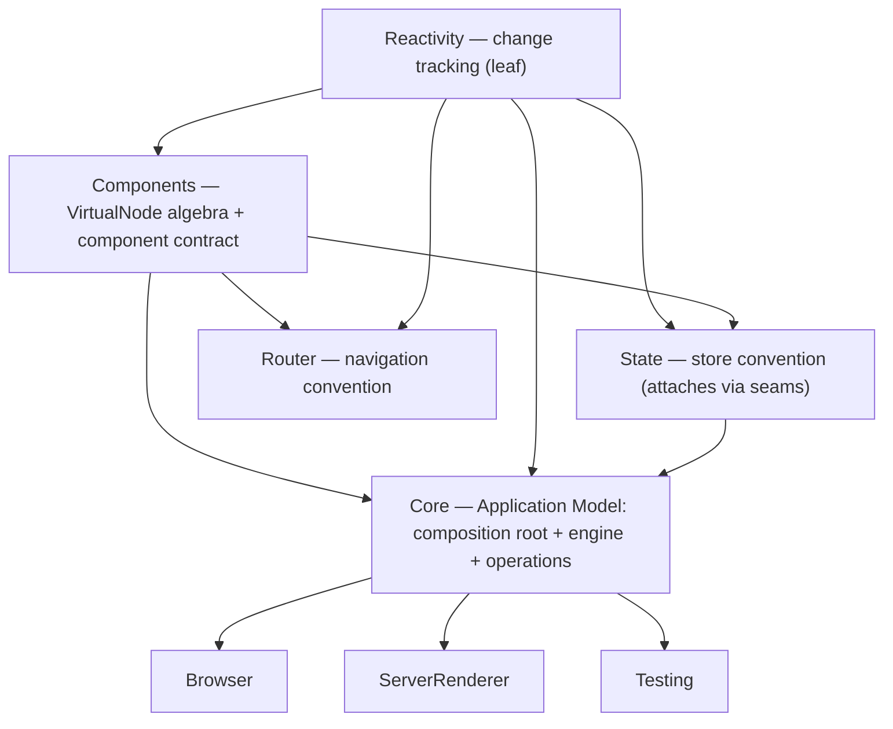

# Component model plan of record

> **Arc:** `[V01.01.15]` — epic [#313](https://github.com/assimalign/viu/issues/313), features
> [#314](https://github.com/assimalign/viu/issues/314) through
> [#317](https://github.com/assimalign/viu/issues/317).
> **Implementation branch:** `feature/V01.01.15-component-model`.
> **Status:** implemented in the shipping runtime tree; the phase descriptions below are the
> completion record for the migration.
> **Precedent:** this plan follows the graduation and execution model established by
> [`NET-RESHAPE-PLAN.md`](NET-RESHAPE-PLAN.md).

This document records the adopted disposition implemented by the shipping runtime libraries. It
keeps the closed virtual-node tree while retaining the authored-component abstraction in
`Assimalign.Viu.Components`. The disposition was produced from a repository-wide survey, three
independently developed designs, and an adversarial critique of each; the file and line citations
below were verified against the working tree. Mobile and native platform work remains outside this
arc.

---

## 1. Design review that selected the shipping model

The early prototype identified the right problems but overshot in one decisive way and exposed five
concrete defects. The counterproposal in §2 corrected those defects and is the model that now ships.

### What it gets right (keep all of this)

| Idea | Why it is correct |
|---|---|
| **Four lifetimes conflated under "component"** | Matches spec `[CMP-1]` (SPECIFICATION.md:199-211), which already separates render description / authored behavior / mounted bookkeeping; the static contract is the implicit fourth. The shims exist because those roles cross assembly boundaries as one vocabulary. |
| **Closed `VirtualNode` algebra** | The superseded discriminator-plus-interface model let its discriminator and runtime interface disagree, forcing specialization casts in the renderer and serializer plus repeats in every test double. A `private protected`-constructor base with sealed variants deletes that bug class structurally. History confirms this is a *restoration*: `VirtualNode` existed until commits `5468dd2`/`166ec7b` (2026-07-23) swapped it for the former `*Component` tree. |
| **Raw invocation vs. normalized bindings, no shared interface** | The duplicated arguments, slots, and attributes on the former mounted-context interface and former template/element node interfaces represented different lifetimes wearing the same names. `ComponentInvocation` (parent's request) versus `ComponentBindings` (mounted, normalized) dissolves the duplication instead of renaming it. |
| **Built-ins as structural nodes + internal Core executors** | Kills `MountedComponent.CreateTemplate`'s `typeof`/name probing (`MountedComponent.cs:84-132`) and the `Suspense.Setup` context downcast (`Suspense.cs:68`). |
| **Hot-reload metadata via hidden registration ABI** | Replaces the former public generated-metadata interface with a name-bound static call — the same posture `ComponentHotReload.ApplyUpdates` already has. |
| **Lease-based SSR, snapshot-based Testing** | Matches exactly what `ServerComponentRenderer.cs:30-54` and `ComponentWrapper.cs` actually drive through `InternalsVisibleTo` today, and matches T05's already-decided shapes (`IComponentRenderScope`, `IMountedTemplateView`, API-HARDENING-PLAN.md:242-296). |
| **State decoupled from components** | The former state context's component-factory and owner members had zero production consumers; the store used only its reactive scope and watch scheduler, and the former context overload never recorded an owner. |

### Where it is wrong

1. **It removes the entire Component abstraction from Components.** In the early prototype, Components
   retains *no* authored-component concept — no `IComponent`, no context, no lifecycle, no
   activation. Everything behavioral would have moved to Core.
   Concrete casualty: **Router references only Components + Reactivity** and its csproj states
   "Router does not depend on a renderer or host application implementation"
   (`Router/src/Assimalign.Viu.Router.csproj`). Under that proposal, `RouterView`/`RouterLink`
   (authored components) would force Router → Core. The authoring surface in Components is
   load-bearing, not incidental.
2. **`RenderPlan` invents a new patch-flag enum** (`{None,Text,Bindings,Children,Full}`),
   contradicting the *frozen, additive-only* `PatchFlags` bit layout that generated code emits as
   raw integers (`[RND-FLAGS-1]`; the superseded static helper cast `int → PatchFlags`; `Cached=-1`/`Bail=-2`
   sentinels). This is the single most frozen contract in the repo.
3. **Built-in node shapes are thinner than the features they replace.** `TransitionNode
   {Identifier, Child}` has no home for BaseTransition's 16 declared parameters
   (`BaseTransition.cs:26-44`); `KeepAliveNode` drops include/exclude; eager `SuspenseNode.Content`
   forces slot evaluation where today's `ComponentSlot` delegates are lazy — a semantic change to
   `withCtx`/re-render granularity, not a refactor. (All three independent critics converged on this.)
4. **The former common utility package needed a landing zone for the netstandard2.0 link.** The
   compiler host cannot reference net10.0 assemblies, so `Syntax.Templates` *links source files*
   (`PatchFlags.cs`, `SlotStability.cs`, `DomKnowledgeData.cs`) from their shipping owners at frozen paths. Contents
   must be re-homed deliberately, with the `[RND-FLAGS]` path clause updated in the same commit.
5. **The `.viu` pipeline was unmodeled** and the early prototype missed a
   shim it should have diagnosed: `IComponentWarningContext` is another public capability-by-cast
   interface (consumed by Browser's `TransitionGroup.cs:95`) — structurally identical to
   former state-store context shim.

---

## 2. Counterproposal: name the layer charter, then enforce it with seams

> **Revision note.** An earlier draft of this section recommended `Components → State` with a typed
> `IStateStoreRegistry? State` property on the context. Withdrawn after the layer-charter
> discussion: State is a *convention* layered on the component model, and the repo already contains
> the correct attachment pattern — Router resolves its service through `context.Services`
> (`Router/src/Internal/RouterResolution.cs:22`) with no cast, no bridge interface, and no friend
> access. State migrates to that pattern instead of getting a privileged context member.

The shim treadmill exists because attachments were made without designed seams. The charter:

| Library | Role | References |
|---|---|---|
| `Reactivity` | Change/state tracking | leaf |
| `Components` | **The component model**: the closed `VirtualNode` tree *and* the authored-component contract (`IComponent`, abstract `ComponentContext`, contract/invocation/bindings) | Reactivity only — change tracking is *intrinsic* to the model (a component **is** a reactive render function; the tree is its output) |
| `State` | A state-management *convention* above the model | Reactivity + Components (Router-style: attaches through the context's seams, never a cast) |
| `Router` | A navigation *convention* above the model — already the model citizen | Components + Reactivity |
| `Core` | **The Application Model**: the composition root (D5/D5a `ApplicationOptions`/`ApplicationContext`, lifetime, middleware), the engine (renderer, scheduler, mounted internals), and the public operations (render lease, mounted views) | Components, Reactivity, State (composition-root sugar) |
| Hosts (`Browser`, `ServerRenderer`, `Testing`, future platforms) | Platform adapters behind the host contract | Core |
| Styling (component CSS modules and scoped CSS) | Build-time concern; compiled trees carry scope identifiers as ordinary static attributes, so the runtime component context carries no style-scope state. The utility-CSS add-on is parked and outside this model. | compiler tooling — never in the runtime graph |

Vocabulary lives low (Components declares what things *are*); composition lives high (Core wires
what the *application* uses); conventions attach through seams. Core containing both the
application model and the engine is acceptable cohabitation — hosts see only `RendererOptions` and
the operations, so an engine split (`Assimalign.Viu.Rendering`) stays possible later without
breaking the charter; it adds nothing today (D2 packaging).

### Dependency graph (end state)



- The former common utility package is dissolved (map in §5).
- **No production `InternalsVisibleTo` anywhere** — the four grants on Core
  (`Core/src/Properties/AssemblyInfo.cs:3-6`) shrink to `Assimalign.Viu.Core.Tests` (D8).
- Router is untouched. State keeps its existing Components reference but sheds the shim (§2a).
- Tooling is untouched by layering: generators bind runtime members *by name* (`[SFC-CG-2]`) and
  link source; they reference no runtime assembly.

### 2a. The open/closed seams

The component model is **closed**: sealed `VirtualNode` variants behind a `private protected` ctor,
one runtime `ComponentContext` implementation, immutable contracts. Extension is **open** through
exactly four designed seams — and nothing else:

1. **The host contract** (`RendererOptions<TNode>`, `[RND-HOST-1]` "the complete host contract;
   Core has no host handles") plus the public operations (render lease, mounted views) → how
   *platforms* attach (§4a).
2. **`context.Services` + the ambient reactive scope** (`Reactive.CurrentScope`; `Setup` runs inside
   the component's scope) → how *conventions* attach. Router proved it; State now follows it:
   `Use(context)` becomes `context.Services?.GetService(typeof(IStateStoreRegistry)) ?? ambient`,
   and Core — as composition root — wires `ApplicationOptions.State` into the application provider.
   The former state-store context shim and its cast were deleted with no successor.
3. **The generated-code ABI** (the frame-based calls in `[SFC-CG-2]`, the `IComponent`/contract
   vocabulary, the hidden hot-reload registration) → how *authoring dialects and compilers* attach
   (`.viu`, `.vue`, a future markup dialect — new tooling package, zero runtime change).
4. **Application composition** (D5a options/middleware) → how *policies* attach (schedulers, error
   handling, DI, state registry wiring).

The standing rule that keeps it clean — worth adding to `.claude/rules/` alongside D8: **a library
may attach to the component model only through one of these seams. If an integration needs a cast,
a friend grant, or a new bridge interface, the seam is missing, and the seam — not a shim — is the
fix.** (This is D8's own logic — "two assemblies that need each other's internals … have an API
nobody wrote" — extended from internals to capability discovery.)

### Type placement (load-bearing types)

| Type | Assembly | Shape |
|---|---|---|
| `VirtualNode` (`Kind`, `Key`, `RenderPlan`) | Components | public abstract, **`private protected` ctor** — closed; `Kind` set by each sealed variant's ctor, so kind and type can never disagree |
| `ElementNode, TextNode, CommentNode, StaticNode, FragmentNode, TeleportNode, ComponentNode` | Components | public sealed : VirtualNode |
| `KeepAliveNode, SuspenseNode, TransitionNode` | Components | public sealed : VirtualNode, **each carrying a `ComponentInvocation` payload** (arguments + lazy slots — fixes defect 3) |
| `QualifiedName`, `ElementBinding(+Kind)`, `DirectiveInvocation` | Components | record struct / sealed |
| `RenderPlan` | Components | sealed; carries **frozen `PatchFlags` raw-int semantics with `Cached`/`Bail` sentinels** (fixes defect 2) + three-state `DynamicChildren` per `[RND-BLOCK-1..7]` |
| `ComponentReference`, `ComponentContract`, `ComponentInvocation`, `ComponentParameter/Event`, `ComponentFlags` | Components | sealed |
| `ComponentBindings` + pure static `Resolve(contract, invocation) → (bindings, diagnostics)` | Components | sealed; the alias/fallthrough *data transformation* from today's `ComponentContext.Update` (`Internal/ComponentContext.cs:66-93, 226-287`), unit-testable with no runtime |
| `IComponent` (authored contract: `ComponentRenderer Setup(ComponentContext)`) + `ComponentBase` | Components | interface / abstract base (name lands last — see migration; `[CMP-31]` posture kept: the base does not implement the interface) |
| `ComponentContext` | Components | **public abstract**, protected ctor — full surface below |
| `ComponentLifecycle`, `ComponentRenderer`, `ComponentSlot`, `ComponentActivator`, `ComponentRegistration` (now `(Reference, Contract, Activator)`), `IComponentFactory`/`ComponentFactory` | Components | as today, contract moves onto registration |
| `PatchFlags/SlotStability/ShapeFlags`, `NameNormalization` (+ hyphenation) | Components | frozen value contracts, relocated with their tests during the arc |
| `RuntimeComponentContext : ComponentContext` | Core | **internal sealed** — the only runtime implementation; owns emit once-dedup, ambient `Run`, `SuspenseBoundary`, per-mount default cache, initial-mount warning gate |
| `MountedComponent`, mounted node variants, built-in executors (renderer partials) | Core | internal |
| `ComponentHost.RenderAsync(...) → IComponentRenderScope { Tree; Context; DisposeAsync=abort }` | Core | public — T05's decided shape; packages activate → setup-in-scope → prefetch → render-once → abort exactly as `ServerComponentRenderer.cs:30-54` sequences it today |
| `IMountedTemplateView<TNode> { Request; Instance; Context; FirstHostNode; LastHostNode; IsMounted }` + `Renderer<TNode>.GetMountedTemplateViews` | Core | public — T05's shape widened per Testing's real needs (`ComponentWrapper.cs` type-filters on `Instance`) |
| `ApplicationOptions.EventObserver`, deterministic-scheduler install/reset seam | Core | public — replaces Testing's internal-field pokes |
| `ComponentRenderFrame`, Browser directive tokens, `ComponentHotReload.Register` | Components / Browser / Core | frame calls are the generated render ABI; hot-reload registration remains the only name-bound static ABI |
| `HydrationMarkers` (single vocabulary) | Core | public — replaces the three-way duplication (`SsrMarkers.cs:19-45` / `Renderer.Hydration.cs:17-19` / `TestServerMarkup.cs:45`); ServerRenderer, Testing, and Core all already reference Core |

### The context — the heart of the fix

```csharp
public abstract class ComponentContext          // Assimalign.Viu.Components
{
    protected ComponentContext();

    public abstract ComponentBindings Bindings { get; }        // Parameters / Slots / FallthroughBindings
    public abstract IServiceProvider? Services { get; }
    public abstract ComponentLifecycle Lifecycle { get; }
    public abstract IReactiveEffectScope Scope { get; }        // first-class: Components → Reactivity
    public abstract IReactiveWatchScheduler? WatchScheduler { get; }
    public abstract ComponentContext? Parent { get; }          // subsumes T05's planned addition
    // No runtime-carried scoped-style identity: compiled trees stamp ordinary attributes (§7 decision 4).
    public abstract void Emit(string name, params object?[] arguments);
    public abstract void Expose(object? value);
    public abstract void Warn(string message);                 // replaces IComponentWarningContext

    public WatchHandle Watch(...);                             // concrete: Reactive.Watch + WatchScheduler
    protected abstract void OnWatchError(Exception exception); // Core routes to OnErrorCaptured
}
```

Note what is *not* here: no `State` member, no per-convention properties. `Scope`, `WatchScheduler`,
and `Services` are model vocabulary; everything above the model (State, Router, the next convention)
reaches the context through seam 2 and never earns a property. That is the open/closed guarantee —
adding the next convention modifies nothing in Components or Core.

Every current shim dies **structurally**, not by relocation:

- The former state-store context shim and its cast — deleted;
  `Use(context)` resolves through `context.Services` exactly as Router already does
  (`RouterResolution.cs:22`), with the ambient registry as fallback. No successor bridge, no
  extension-method downcast, no privileged context member.
- `IComponentWarningContext` and Browser's pattern-match (`TransitionGroup.cs:95`) — deleted; `Warn`
  is a first-class abstract member.
- Ambient-static `ViuWatch.Watch` (`ViuWatch.cs:23-58`) — becomes `context.Watch(...)`, scoped to the
  component's effect scope by construction.
- SSR's `RequireComponentContext` (`ServerRender.cs:470-480`) — deleted; the serializer reads
  the lease's tree. Scoped CSS is compiler-owned, with ordinary static scope attributes already in
  that tree, so the serializer reads no context-carried style-scope state; that former reach is gone.
- Core's own downcasts (`Suspense.cs:68`, `AsynchronousComponentTemplate.cs:39`,
  `ComponentHost.cs:117`, `Renderer{TNode}.cs:3381`) — become same-assembly typed access to Core's
  internal sealed `RuntimeComponentContext`; no public protocol involved.

**Honest residual**: C# cannot compiler-close an abstract class across assemblies without
`InternalsVisibleTo` (which D8 forbids), so a consumer *can* derive `ComponentContext`. That
derivative is inert — no runtime API accepts a user-supplied context; `Setup` is only ever called by
the runtime with its own context. Document derived-context rejection as contract. Component testing
remains "mount it with `Assimalign.Viu.Testing`", never "fake the context".

### The six original complaints

1. **Duplicated context/component properties** → raw `ComponentInvocation` on `ComponentNode` vs.
   normalized `ComponentBindings` on `ComponentContext`. Different types, different names, one
   documented pure `Resolve` transform. The duplication cannot recur.
2. **Built-ins implemented in Core** → their public descriptions (`KeepAliveNode`, `SuspenseNode`,
   `TransitionNode` — each carrying a `ComponentInvocation`) live in Components; executors stay
   internal Core renderer partials; Browser keeps CSS transition behavior. Renderer dispatch on node
   type is exhaustive — `CreateTemplate`'s `typeof`/name probing is deleted.
3. **Former public generated hot-reload metadata interface** → deleted. The emitter writes a module initializer
   calling `ComponentHotReload.Register(typeof(X), identifier, templateMarker, scriptMarker,
   styleMarker)`, gated **at emit time** by the existing `Configuration`/`ViuEmitHotReloadMetadata`
   options (not `#if DEBUG` in generated text). `Classify` and the reset/remount flow are unchanged.
4. **Common utility package** → dissolved with a named landing zone per type (§5) — including the
   netstandard2.0 linked-source constraint the early prototype missed.
5. **SSR requires a shim** → `ComponentHost.RenderAsync → IComponentRenderScope` (T05's shape);
   ServerRenderer and Testing lose friend access entirely; prefetch-before-render, error→comment
   fallback, and abort-without-client-hooks invariants move inside Core where they belong.
6. **Tooling APIs public** → already governed by D8's accessibility≠packaging rule
   (API-HARDENING-PLAN.md:135-144); tooling types go public in tooling packages; the projection
   projection-facade idea from the prototype was retained. No design change was needed here.

---

## 3. Generated `.viu` code (the contract codex left unmodeled)

Generated render code now binds through its `ComponentRenderFrame` parameter. The emitter owns the
statement-form block assembly and direct node construction, so author code no longer imports a
mutable static helper surface by name.

```csharp
partial class Counter : Assimalign.Viu.Components.ComponentBase, IComponent
{
    static readonly ComponentContract __ViuContract = new(
        "Counter", ComponentFlags.InheritFallthroughBindings,
        parameters: [ new ComponentParameter("count", ...) ],
        events:     [ new ComponentEvent("increment") ]);

    internal static VirtualNode? Render(Counter instance, ComponentRenderFrame frame)
    { /* statement-form block assembly, direct node construction, frozen raw-int patch flags */ }

    ComponentRenderer IComponent.Setup(ComponentContext context)
    {
        Context = context; __ViuBindParameters(); OnSetup();     // initial bind [CMP-29]
        return frame =>
        {
            __ViuBindParameters();                               // rebind per render [CMP-29]
            return Render(this, frame);
        };
    }

    // Emit-time-gated hot reload:
    // [ModuleInitializer] internal static void __ViuHotReload()
    //     => ComponentHotReload.Register(typeof(Counter), "...", typeof(__TM), typeof(__SM), typeof(__CM));
}

// @script authoring surface — no Core types, no capability casts:
//   var store = CounterStore.Definition.Use(Context);   // seam 2: Services + ambient, Router-style
//   Context.Watch(count, (current, previous) => ...);   // model vocabulary: first-class
//   Context.Emit("increment", current);
```

Registration carries the contract (`ComponentRegistration(Reference, Contract, Activator)`), so the
runtime reads parameters/events **before activation** — required for hot-reload remount ordering and
`ComponentBindings.Resolve`. Activation stays pure delegate dispatch (`[CMP-4]`/`[EXE-4]`); nothing
here touches reflection, so AOT/trimming posture is unchanged.

**SSR path**: `ServerRender` → `ComponentHost.RenderAsync(renderRequest, ct)` → lease →
serializer walks `scope.Tree` → emits `HydrationMarkers`
comments → `await scope.DisposeAsync()`. No friend access, no downcast.

---

## 4. Qualified-name fix incorporated during implementation

`Renderer<TNode>` hardcodes `"svg"`/`"math"`/`foreignObject` namespace rules in the generic layer
(`Renderer{TNode}.cs:3183-3202`). With `ElementNode.QualifiedName`, namespace assignment becomes a
compiler/host concern: the template compiler lowers known-namespace elements, and
`RendererOptions<TNode>` (already the complete host contract per `[RND-HOST-1]`) carries the
namespace policy for the dynamic cases. The shipping `QualifiedName` model and host contract carry
that separation without adding markup-language knowledge to Core.

### 4a. What "platform agnostic" means here

A new platform must be *addable without modifying* Components or Core (open/closed, seam 1). With
this design, a platform touches exactly two extension points:

- **Runtime**: a host package implementing `RendererOptions<TNode>` (plus platform bootstrap over
  the D5a application surface). Core dispatches on the closed algebra and `QualifiedName`; it holds
  no host handles and, after §4, no markup-language knowledge.
- **Authoring**: optionally, a compiler *target profile* — the shared parser/semantic pipeline stays
  common; final lowering selects the binding vocabulary and rejects unsupported features at build
  time. (The one idea worth keeping from the prior conversation's native-platform section.)

The honest gate: **Browser must stop being a compile-time friend of Core.** A compiler-verified
audit (grants removed from `Core/src/Properties/AssemblyInfo.cs`, consumers rebuilt, every errored
member promoted iteratively until the builds went clean — defeating Roslyn's declaration-error
masking) found the footprint is far smaller than earlier grep estimates suggested. Browser's entire
friend surface is the **`[APP-1]` application-lifecycle machine**: the internal `ApplicationState`
enum plus `ApplicationContext.InitializeRuntime`/`SetIsRunning`
(`BrowserApplication.cs:41,68,367,502,596-682`). It needs **zero** `RendererOptions` hooks —
Browser compiles against the renderer using only public surface, so `[RND-HOST-1]` stands
unamended and the host seam is *already* complete for rendering. The platform-agnostic guarantee is
therefore cheap: seam **S1** (§8) hoists the platform-invariant lifecycle machine into Core, and
the Browser grant falls immediately — independent of the tree redesign. ServerRenderer moving to
the render lease is the same proof for one-shot hosts.

Do **not** build `HostNode`/portable-control abstractions now. The seams make that door openable
later without a redesign; opening it before a second platform exists would be speculative
generality — the exact opposite of closed-for-modification.

## 5. Shared dissolution map

| Content | New home | Note |
|---|---|---|
| `PatchFlags`, `SlotStability`, `ShapeFlags` | Components | frozen layout preserved; `Syntax.Templates` linked-source paths re-pointed, `[RND-FLAGS]` frozen-path clause updated in the same commit |
| `NameNormalization` (+ hyphenation pulled from `StyleAndClassNormalization`) | Components | required by the pure `ComponentBindings.Resolve` alias tables |
| `StyleAndClassNormalization` (value normalization), `DisplayStringFormatter` | Core | consumers (Core, Browser, ServerRenderer) all reference Core |
| `LooseEquality`, `NumberCoercion` | Browser | sole consumer |
| `DomKnowledge` / `DomKnowledgeData.cs` | ServerRenderer, linked source | existing `<Compile Include>` precedent (VS extension keeps linking) |
| `PatchFlagNames` | tooling (`Syntax.Templates`) | codegen diagnostics only |
| Hydration marker vocabulary (currently triplicated) | **new** `HydrationMarkers` in Core | not a Shared revival — one owner, one purpose |

## 6. Completed migration sequence (D1 — plain renames, no `[Obsolete]` shims)

- **P0 — characterization tests, completed**: render-run counts, block-visit counters, scheduler
  ordering, SSR lifecycle/output, Testing queries, and hot-reload classification.
- **P1 — State shed the shim, completed**: deleted the former state-store context bridge and Core's
  implementation of it; reimplemented `Use(ComponentContext)` Router-style via
  `context.Services` with the ambient registry as fallback; Core wires `ApplicationOptions.State`
  into the application provider (composition-root work). Delete `IStateContext.Components`/`Owner`
  and the registry's `IComponentFactory` ctor arg (zero production consumers). State keeps its
  Components reference — same direction as Router. Update the pinning test
  (`ComponentRuntimeTests.cs:170-185`).
- **P2 — the tree swap train, completed** (the blast-radius peak, one atomic train): `VirtualNode` algebra +
  flag enums into Components; retarget `Renderer<TNode>` + partials (Kind-switch → type-switch,
  deleted `Require*`), former static node-factory bodies, `ComponentTreeSerializer`, and test doubles
  (`FakeHost.cs:278`, `InMemoryHandleDom.cs:248`); `ComponentRenderer`/`ComponentSlot` return types
  flip to `VirtualNode?` here. Spec §4/§6 vocabulary amended in the same train (`[CMP-1..3]`,
  seven-kind table → node kinds, `[BLT-1..4]`, `[RND-3]`).
- **P3 — context split, completed**: abstract `ComponentContext` + `ComponentBindings.Resolve` (with
  diagnostics list; runtime keeps the per-mount default cache and initial-mount warning gate) in
  Components; `RuntimeComponentContext` in Core; contract moves onto registration; emitter `Setup`
  signature update; delete `IComponentWarningContext`; retire ambient `ViuWatch`.
- **P4 — operations, completed**: `ComponentHost.RenderAsync` lease, mounted views, `EventObserver`, scheduler
  seam, `HydrationMarkers`; **remove the ServerRenderer and Testing grants**.
- **P5 — built-ins + hot reload, completed**: structural nodes with invocation payloads; executor dispatch by
  node type; `ComponentHotReload.Register` ABI; emitter emits contract + module initializer.
- **P6 — closures, completed**: common-utility dissolution; PublicAPI baseline regeneration after
  the tree train; and the final authored-contract rename to `IComponent` / `ComponentBase` after P2
  removed the superseded tree-root use of that name. *(The Browser seam audit originally scheduled
  here resolved early: the
  compiler-verified inventory in §8 shows Browser's only friend surface is the application
  lifecycle, retired by seam S1 — landable now, ahead of P2.)*

**T05 disposition**: the runtime-facing rows were superseded under the deviations protocol. The
render scope, mounted views, dependency-injection nullability, and `ApplicationState` landed through
P4; the planned two-member interface expansion was replaced by the public abstract
`ComponentContext`. Mechanical T05 work remained unaffected.

## 7. Implementation decisions closed by the arc

1. **~~The `Components → State` edge.~~ Resolved** by the layer charter (revision note, §2): no
   edge, no typed `State` property. State attaches through seam 2 (`Services` + ambient) exactly as
   Router does. The context stays convention-free; the next convention costs zero model changes.
2. **Built-ins use dedicated node types.** Sealed nodes carrying `ComponentInvocation` provide
   exhaustive renderer dispatch and a self-describing algebra; specializing ordinary component
   references was rejected as the weaker boundary.
3. **The authored contract is `IComponent`.** Components are authored behavior, nodes are immutable
   descriptions, and `ComponentNode` invokes a component.
4. **Runtime style-scope identity — descoped (owner decision, 2026-08-07).** Scoped CSS itself is
   fully active: the compiler rewrites selectors and stamps each known `data-v-*` attribute directly
   into the generated render description. What this arc removed was the alternate runtime-carried
   identity (`ComponentContract`/`ComponentContext` state, an SSR serializer attribute pass, and
   runtime emitter propagation). Consequences, all simplifying: T05 Core decision 4's planned member
   is moot; the `ComponentTreeSerializer.cs:97` friend reach disappears outright rather than needing
   a public member; P3's context and the contract carry no style-scope state. Component CSS bundling,
   scoped styles, CSS Modules, `v-bind()` rewrites, and style-only hot reload remain compiler/SDK
   concerns and are unaffected.

---

## 8. Execution disposition (compiler-verified)

### 8.1 The real friend-access inventory

Method: the three production grants were removed from `Core/src/Properties/AssemblyInfo.cs`, each
consumer rebuilt, and every errored member promoted iteratively until the builds went clean —
Roslyn suppresses method-body diagnostics while declaration errors exist, so error *counts* lie; a
clean build after promotion is the only complete enumeration. Result:

| Consumer | Entire Core-internal footprint | Retired by |
|---|---|---|
| **Browser** | `ApplicationState` enum + `ApplicationContext.InitializeRuntime` + `SetIsRunning` — the `[APP-1]` lifecycle machine, nothing else | **S1** |
| **ServerRenderer** | `ComponentContext` (including the former runtime scoped-style reach removed when compiler-owned attributes replaced it) + `MountedComponent` (`Create`/`InvokeServerPrefetchAsync`/`Render`/`Context`/`AbortMount`) | **S4** (T05's lease) |
| **Testing** | `MountedTemplateNode<TNode>`/`MountedRenderNode<TNode>`/`MountedComponent` members, `ComponentContext.Parent`, `Renderer<TNode>.GetMountedTemplates`, `Scheduler.Reset`/`FlushDispatcher`, `ApplicationOptions.EventObserver` | **S5 + S2 + S3** |

Browser needed zero `RendererOptions` hooks — `[RND-HOST-1]`'s completeness claim survived the
compile proof untouched. `IComponentWarningContext` (public shim, `TransitionGroup.cs:95`) dies
separately at P3 via `ComponentContext.Warn`.

### 8.2 The seams

- **S1 — `ApplicationLifetime`** (Core, `Application/`): public sealed class hoisting the
  platform-invariant `[APP-1]` transition machine out of `BrowserApplication.cs:596-682` —
  `State`, `HasFailed`, `Stopping` (CT), `StartExecution`, `SignalRunning`, `RequestStopping`,
  `CompleteStopping`, `Fail`, `IsStoppingCancellation`, `Dispose` — plus `ApplicationState`
  promoted (already T05 Core decision 3). `InitializeRuntime`/`SetIsRunning` stay internal, called
  by the lifetime inside Core; constructing a lifetime *claims* the context (single-attach guard).
  Amend `[APP-1]`'s "internal single-use state machine" wording in the same commit; pin
  transitions (including cancel-before-report ordering on `Fail`) in Core tests. **Retires the
  Browser grant. Independent of P2/P3 — landable now.**
- **S2 — deterministic scheduler seam** (Core): `Scheduler.UseFlushDispatcher(Action<Action>) →
  IDisposable` (install/restore) + `Scheduler.Reset()`; both `[EditorBrowsable(Never)]` with
  test-host-only docs, following the former hidden-generated-API precedent.
- **S3 — `ApplicationOptions.EventObserver` goes public.** Signature is typed on the context, which
  P3 replaces — either land now and accept the D1 plain-rename churn, or fold into P4. Recommended:
  fold into P4.
- **S4 — the render lease** (T05's `ComponentHost.RenderAsync → IComponentRenderScope`): lands in
  P4; depends on P3 only for the abstract context type (compiler-owned scoped attributes mean the
  serializer needs no context-carried style identity, and `Parent` is Testing's need, not SSR's).
  Placement rationale
  (recorded so it isn't re-litigated): `IComponentRenderScope` lives in **Core, not Components**,
  even though its members are all Components types — it is a handle to lifetime 4 (mounted
  bookkeeping, `[CMP-1]`/`[CMP-2]`), only the engine can produce or satisfy it, and its only
  consumers (one-shot hosts) already reference Core; declaring it lower would be a dangling
  cross-layer contract, repeating the former state-store bridge problem in mirror image. It stays
  an *interface*
  (T05's shape) rather than a sealed lease solely so host-side tests can fake a scope under D8's
  no-cross-library-friends rule. Contract note: the
  lease's `Context` must
  be usable as the `parent` of a nested `RenderAsync` (the serializer recurses) — pin with a
  nested-component SSR test. **Retires the ServerRenderer grant** (with `HydrationMarkers`).
- **S5 — mounted views** (T05's `IMountedTemplateView<TNode>` + `GetMountedTemplateViews`): lands
  in P4; the view needs `Request` + `Instance` members beyond T05's three, and **stable per-node
  view identity** — `ComponentWrapper` depends on `ReferenceEquals` across enumerations
  (`ComponentWrapper.cs:151,321`), so Core must cache one view per mounted node (state it in the
  XML contract, pin with a test). **Retires the Testing grant** (with S2 + S3).

Definition of done for "no production friends": `Core/src/Properties/AssemblyInfo.cs` contains
exactly one grant (`Assimalign.Viu.Core.Tests`); each consumer builds clean in isolation (clean
build, not error count — masking makes counts untrustworthy); `Assimalign.Viu.slnx` builds 0/0; new
surface in `PublicAPI.Unshipped.txt` with clause-cited XML docs.

### 8.3 Fit with the API Hardening Plan ([V01.01.14])

Recorded position: Waves 1 and 2A are merged; **T05 is next and has no WBS/issue assigned yet** —
so the redesign arrives at exactly the right moment: nothing in flight is invalidated.

1. **Record a `D9` row** in the plan's decisions table: the component-model redesign
   (this document) is adopted; it supersedes T05 Core decision 4 (the former context interface's
   two-member addition and "`ComponentContext` stays internal" — both members land on P3's abstract
   `ComponentContext` instead) and re-times Core decisions 5–6 (lease, views) into the redesign's
   P4. Per the plan's own convention: amendment rows in the decisions table, T05 section edited to
   match, State table updated in the same commit.
2. **T05 splits three ways**: (a) the ~17 tooling decisions and Core decisions 1–2
   (`EmptyComponentFactory` deletion + `ComponentFactory` unsealing; DI nullability) proceed now,
   unaffected; (b) Core decision 3 (`ApplicationState`) is absorbed into S1; (c) Core decisions 4–6
   are superseded/re-timed per D9.
3. **The redesign is its own arc**, not a T05 subtree: a new area epic on Project #15 (next free
   `V01.01.NN`) with this document promoted to `docs/` as its plan (the `NET-RESHAPE-PLAN.md`
   precedent), features per phase. Proposed trains, honoring the plan's serial-Core-wave rule:
   - **Now, parallelizable on stacked branches**: P0 characterization tests · S1 (+T05 decision 3)
     · P1 State-sheds-the-shim · S2 · T05 tooling/mechanical decisions.
   - **Then, serial**: P2 tree swap → P3 context split → P4 operations (S3/S4/S5; ServerRenderer
     and Testing grants fall) → P5 built-ins + hot-reload ABI → P6 closures.
4. **PublicAPI baselines** regenerate only after the tree train (the plan's own rule: the baseline
   must never record surface that is about to go — and the redesign removes far more surface than
   T05 would have).

---

## 9. Late scope decisions (owner-requested, 2026-08-07)

### 9.1 The former static render-helper ABI is deleted

The superseded static render-helper class was public for one reason: compiled render bodies live in
*consumer* assemblies and bound about 40 members by name through `using static` (`[SFC-CG-2]`),
with block collection held in **ambient static state** (`BlockFrames`,
`_blockTrackingDepth`, explicitly single-threaded, with `ClearBlockTrackingAfterRenderFailure` as
the failure-recovery hack). The underscore prefix exists only because `using static` dumps those
names into the same partial class that holds the author's `@script` code.

The redesign removes the *premise*, not just the type: `ComponentRenderer` becomes
`VirtualNode? ComponentRenderer(ComponentRenderFrame frame)`, and the Components-owned
**`ComponentRenderFrame`** (per mount, created by the engine) carries the render cache and block
assembly (`OpenBlock`/`Track`/`CloseBlock`/`CacheHandler`). Compiled output calls members through
the frame *parameter* — no static imports, no reserved prefixes, no ambient state. Survey 5's full
helper inventory maps cleanly:

| Former helper family | Destination |
|---|---|
| `_openBlock`/`_setBlockTracking`/`_createBlock` and the former sequencing token | frame block assembly; the token was deleted because statement-form emission removed its only purpose (`[RND-BLOCK-3]` expression sequencing) |
| `_create*VNode` node factories | direct `new ElementNode(...)` / `new TextNode(...)` constructors + `frame.Track` |
| `_resolveComponent`/`_resolveDynamicComponent` | `ComponentReference.ForName(...)` — pure description; resolution happens at mount via the factory (Figure 2 step 2), not at render |
| `_resolveDirective`/`_withDirectives` | `DirectiveInvocation(typeof(...), value)` — compiler emits the token directly |
| `_setCache`/`_withMemo`/`_isMemoSame`/`_withHandler` | frame cache slots (`Cache`, `CacheHandler`, memo helpers) |
| `_renderList`/`_renderSlot`/`_createSlots`/`_withCtx`/`_toHandlers` | small pure statics in Components (designed, documented — no underscore) |
| `_mergeProps`/`_normalizeClass`/`_normalizeStyle`/`_toDisplayString`/`_camelize` | Components/Core normalization per the §5 Shared map |
| `NormalizeRoot` | deleted from generated code — the engine normalizes the renderer's output itself (root-fallthrough merge is engine work, not something every component must remember to call) |
| `_Fragment`/`_Teleport`/`_Suspense`/`_KeepAlive`/`_BaseTransition` tokens | node constructors (`FragmentNode`, `TeleportNode`, structural built-in nodes) |
| `DomRenderHelpers` (`_vModel*`, `_withModifiers`, `_vShow`, …) | stays Browser-owned but becomes a *designed* directive/modifier API (qualified static calls; the underscore convention dies with `using static`) |
| `ComponentHotReload.ApplyUpdates`/`Register` | the **only** remaining name-bound generated-code ABI |

**Refinement (owner question, 2026-08-07): can the ABI hide inside the consumer assembly, linked-
source style?** Partially — and the partial is adopted. The dividing line is type identity across
assemblies. The `Syntax.Templates` ↔ Shared linking precedent works only because patch flags cross
that boundary as raw ints; nothing has to unify. The frame and the node types cannot be
internal-linked: Core instantiates the frame and the `ComponentRenderer` signature names it, the
renderer's node output flows back into Core's diff, and components ship in class libraries — a
per-assembly internal copy of a state- or identity-bearing type never unifies (the classic
source-only-package failure mode). The hot-reload ABI fails the same test in state form (one
runtime registry, not one per assembly), and Browser directive tokens are `typeof` identity.
The resulting three-tier disposition:

1. **Public by necessity** (state/identity crosses assemblies): `ComponentRenderFrame`, node
   constructors, `ComponentReference`/contract/invocation, normalization statics,
   `ComponentHotReload` (hidden), Browser directive tokens. Designed API — also the surface
   code-first components (§9.2) author against, so it earns its public status.
2. **Dissolved** — statement-form emission turns most former helpers into emitted code shapes
   (list rendering → `foreach`, slot contexts → closures, slot sets → dictionary literals); no
   call remains to hide.
3. **Internal glue** — residual shared shims are emitted by the source generator as an
   `internal static` helper class **inside each consumer compilation**, calling only tier-1
   public surface. Generator emission, not MSBuild `<Compile Include>` from the SDK: no packed
   loose source to version-skew against runtime binaries, no analyzer noise in consumer builds,
   and it stays on the one sanctioned metaprogramming path (`[EXE-4]`, ADR-0001) instead of
   adding a second injection channel to maintain.

Wins beyond aesthetics: per-frame state makes failed renders discard cleanly and removes the
ambient-static blocker on concurrent SSR noted by the earlier critique.

**Supersessions to record in D9**: the API-hardening refuted-findings rows protecting
the former static helper's handler-cache and underscore members (`API-HARDENING-PLAN.md:613-655`) were
correct *within the old architecture* and are superseded by this design change; `[SFC-CG-2]` and
`[RND-BLOCK-3]` are amended in the same train. **Sequencing**: fold into P2 — the tree swap
already forces a full emitter retarget, and shipping an intermediate static-helper set that dies
weeks later would be double churn. This grows the P2 train; the P0 characterization suite is the
control.

### 9.2 Code-first components — `ComponentRegistration.Define`

The class-based path (`RouterView`-style: implement the authored contract, register it) already
exists and stays. The addition is the delegate flavor:

```csharp
public static ComponentRegistration Define(string name, ComponentContract contract, ComponentSetup setup);
public delegate ComponentRenderer ComponentSetup(ComponentContext context);
```

An internal `DelegateComponent : IComponent` wraps the setup closure; the registration's activator
is a plain delegate — AOT-safe, zero reflection, zero new lifetimes. Identity is the registered
name (`ComponentReference.ForName`); `new ComponentNode(registration.Reference, invocation)`
invokes it from hand-built trees.

Two deliberate boundaries, recorded so they aren't relitigated:

1. **Composition-only, per ADR-0004.** `Define` takes a *setup closure* — the same shape as
   `IComponent.Setup` — not a configuration object. There is no options-bag overload and none may
   be added; that would be the Options API by the back door.
2. **Hand-built trees patch by full diff.** Code-first render output carries `RenderPlan.None`
   unless the author supplies plans through the frame — correct behavior under the
   `[RND-BLOCK-1]` fallback semantics, just without compiler-informed skipping. The compiler
   pipeline remains the optimization path; `Define` is the escape hatch, not a parallel compiler.

Both landed in Components (`ComponentRenderFrame.cs`, `Delegates/ComponentSetup.cs`,
`Internal/DelegateComponent.cs`, `ComponentRegistration.Define`) and are exercised by contract
tests. Work-item-wise, 9.1 merged into P2 and 9.2 landed with the context and registration shape.
