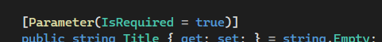
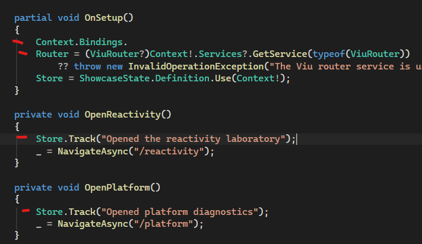
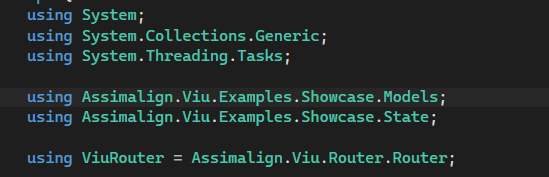
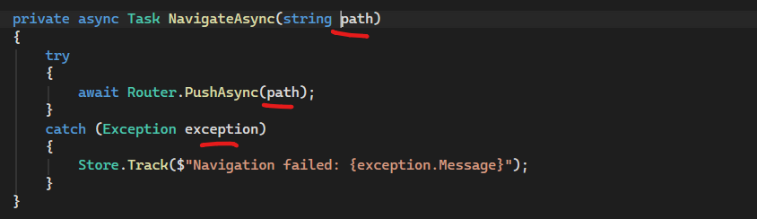
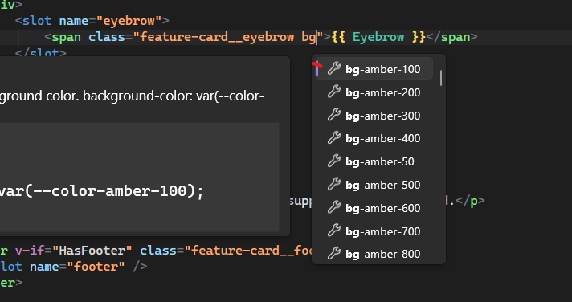
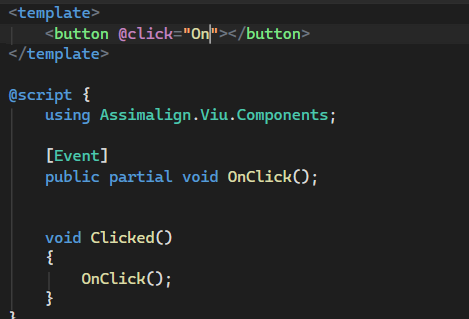
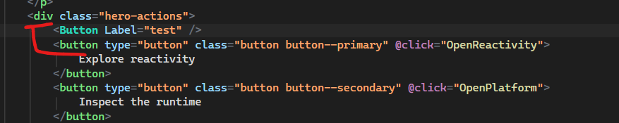
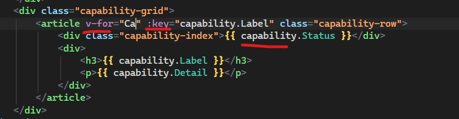
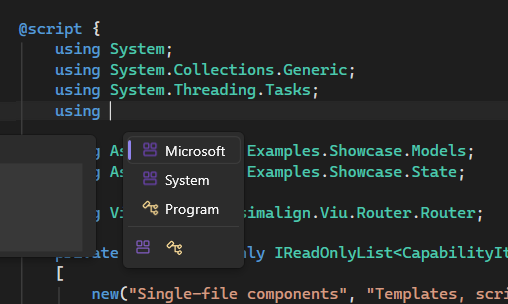
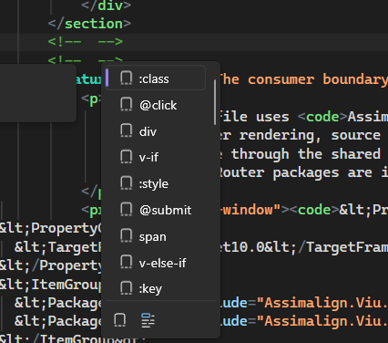

# Theme Enhancements for `.viu` files

1. [`Script Block`] C# Attribute Color needs to be the same color as in Visual Studio. Right now they show up kind golden.  Also property initializers should be white.
2. [`Script Block`] Property identifiers should be white. Currently they are the same color as the class. 
3. [`Script Block`] Property references also need to be standard visual studio white. 
4. [`Script Block`] namespace names in using statement need to be the standard white that is in Visual Studio 
5. [`Script Block`] Parameters and variables need to be the standard light blue color that visual studios has for c#. 

# Template enhancements for `viu` files

**Intellisense**
1. [`Template Block`] Not sure if possible, but I want the actual color to show up next to UtilityCss class names that are color specific within the intellisense. 
2. [`Template Block`] Event handler bindings should have intellisense within the template. Currently nothing shows up 
3. [`Template Block`] Template compiler is unable to differentiate between element tags and components that are of the same name. For example, having a template component called Button will render a `<button/>` element. 
4. [`Template/Styles Block`] Css classes defined in the `<styles></styles>` block should showup in intellisense. Currently they do not.
5. [`Template Block`] Directives (`v-*`), Attribute Bindings (`:some-attribute="..."`), and Expression (`{{expression}}`) have no intellisense support. This needs to be added. 
6. [`Script Block`] The `Assimalign.*` namespace no longer shows up in intellisense. 
7. [`Script/Template/Styles Block`] Intellisense should not showup in comment blocks. It shows up in all three blocks. 

**Tags**
1. No design time errors or warning squiggle tags under any of the code.

**Hovering**
1. No info for any of the elements while hovering.