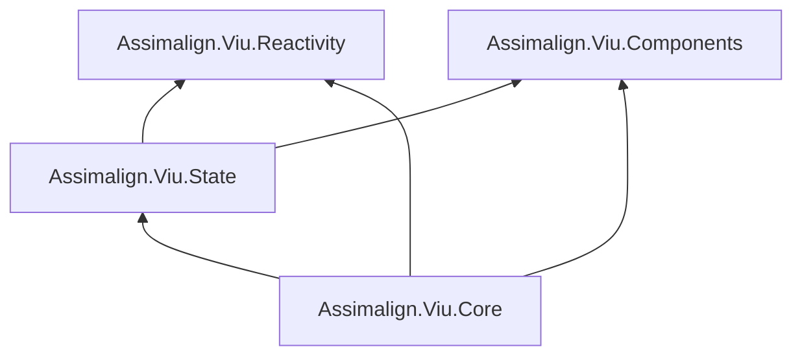

# Viu abstraction split

**Status:** Implemented in the isolated `.redesign` staging tree. Source under `libraries/` remains
unchanged until the user authorizes migration.

## Architecture

The redesign splits the former Core surface into four primary packages:



`Components` and `Reactivity` are independent foundations. `State` combines reactive lifetime with
component and application dependencies. `Core` integrates all three into host-neutral application,
rendering, scheduling, hydration, and built-in behavior.

The staging solution also contains Browser, ServerRenderer, Testing, Router, Router.Browser,
Shared, Syntax, template compilation, single-file component generation, and CSS tooling projects
that consume the new boundaries.

## Unified component tree

`IComponent` replaces the public `VirtualNode` vocabulary. Specialized immutable descriptions
carry only the data relevant to their kind:

- `IElementComponent`
- `ITemplateComponent`
- `ITextComponent`
- `ICommentComponent`
- `IStaticComponent`
- `IFragmentComponent`
- `ITeleportComponent`

Three lifetimes remain intentionally separate:

| Role | Type | Lifetime |
| --- | --- | --- |
| Render description | `IComponent` | Recreated by a render |
| Authored behavior | `IComponentTemplate` | One instance per mounted template request |
| Runtime bookkeeping | Internal Core mounted-node types | Mount through unmount |

This is one public tree vocabulary, not one object lifetime. Core owns host handles, anchors,
reactive render effects, parent links, and prior-tree state internally.

An `ITemplateComponent` request contains a registered `Type` or registered name. Core activates
application templates through `IComponentFactory`; reserved Core built-ins are activated directly
through their explicit AOT-safe registrations. It then calls synchronous
`IComponentTemplate.Setup(IComponentContext)` and uses the returned `ComponentRenderer` for initial
render and reactive updates. Core disposes the activated template after unmount when it implements
`IDisposable`.

Parameters, event declarations and listeners, slots and slot stability, fallthrough attributes,
directives, template references, scoped CSS identifiers, and component-node lifecycle hooks all
travel through this component-tree contract.

## Component factory and services

`IComponentFactory` is only a component resolver:

```csharp
public interface IComponentFactory
{
    IComponentTemplate Create(Type componentType);
    IComponentTemplate Create(string name);
}
```

It does not implement or inherit `IServiceProvider`. The application supplies an
`IComponentFactory` and an `IServiceProvider` as separate values on `IApplicationContext`.

The default `ComponentFactory` dispatches through explicit `ComponentRegistration` delegates and
uses Vue's raw, camel-case, then Pascal-case asset-name lookup for registered names. Applications
may close those delegates over a generated resolver, a standard dependency-injection container, or
hand-written composition. Viu never discovers constructors, scans assemblies, calls
`Activator.CreateInstance`, or generates code at runtime.

The external composition root owns and disposes the component factory, service provider, and state
registry. Core and its application objects borrow them.
The activated template returned for one mount is different: Core owns that instance and disposes a
disposable template after teardown or setup failure. An application can therefore implement
per-component service scopes in its activator and return a disposable wrapper without teaching
Core about a specific dependency-injection container.

Component-tree `provide`/`inject` is intentionally absent. Component dependencies are explicit:

- parameters and slots for parent-to-child data;
- `IComponentContext.Services` for application services;
- State definitions and explicit registries for shared state; and
- `IComponentContext.Components` for deliberate component resolution.

Application plugins are awaited pre-mount initialization hooks over an already-composed
application. They do not imply a mutable component/directive registry: a developer can supply a
mutable custom resolver when plugin-driven registration is wanted, while the built-in resolvers
are composed before `Build()`. This keeps `IComponentFactory` open to arbitrary resolver designs
instead of adding registration methods to the activation contract.

## Lifecycle and asynchronous work

Setup is synchronous so Core receives the render closure and establishes the component's reactive
scope deterministically. `IComponentLifecycle` has synchronous and task-returning overloads for
before-mount, mounted, before-update, updated, before-unmount, unmounted, activated, and deactivated
callbacks. It also exposes the component-lifetime `CancellationToken`.

Core observes task-returning lifecycle callbacks and component-event listeners and routes faults
through `OnErrorCaptured` and the application error handler. Browser separately observes
task-returning host event handlers and routes their faults to the application error handler.
Ordinary lifecycle progression does not await those tasks. ServerRenderer does await
`OnServerPrefetch`, because serialization must wait for its data.

The component token is canceled during unmount after before-unmount callbacks start and before
effect-scope and subtree teardown. Repeated asynchronous callbacks may overlap; application code
chooses cancellation or serialization where required.

## Reactivity

The standalone `Assimalign.Viu.Reactivity` package restores the Vue-shaped separation while
retaining engine improvements made after the earlier consolidation.

The public reference contracts are `IReactiveReference` and `IReactiveReference<T>`. All
Reactivity-owned interfaces use the `IReactive*` prefix. First-party reference implementations
continue to derive from `ReactiveValue`/`ReactiveValue<T>` so substitution does not move hot-path
engine state to interface dispatch.

The `Reactive` facade includes:

- `Reference`, `ShallowReference`, `CustomReference`, and `Computed`;
- effects, batching, tracking control, and effect scopes;
- `Watch`, `WatchEffect`, cleanup, pause/resume, and scheduler contracts;
- `IsRef`, `Unref`, `ToRef`, `IsReactive`, `IsReadonly`, `ToRaw`, and `MarkRaw`; and
- source-generated reactive objects plus reactive lists, dictionaries, and sets.

An effect scope is a lifetime boundary, not a subscription broadcast. A component or child updates
only after an effect, computed, watch, or render reads the reactive value.

## State

`Assimalign.Viu.State` replaces the previous Store package.

`StateStoreDefinition<TStore>` is an explicit AOT-safe setup delegate. `StateStoreRegistry` owns a
detached reactive root scope and creates one child scope and store instance per definition key.
Multiple calls in one registry return the same store; different registries produce isolated
instances. Disposing a registry stops all store-owned reactive work.

Core's mounted context implements the State-owned `IStateStoreContext` capability. Therefore
`definition.Use(componentContext)` can locate the application's registry without making Components
depend on State. This lookup deliberately does not record a component owner for an application
store. Explicit feature registries can pass an owner deliberately.

State supplies both lightweight setup-style stores and the optional `StateStore<TState>` base with
typed `Patch`, `Reset`, `Subscribe`, and `OnAction` behavior over source-generated reactive state.
No state-shape reflection is used.

## Block-tree updates

The unified component tree retains Vue's compiler-informed block-tree strategy.
`ComponentOptimization` carries:

- `PatchFlags`;
- dynamic property names;
- a block root's dynamic descendants; and
- the suspended-tracking marker used by `v-once`.

Generated render code opens a block, records dynamic descendants, and attaches the immutable
snapshot to the block root. Core preserves that metadata through mounted-node processing.
Compatible old and new block roots patch dynamic children directly; incompatible or unoptimized
roots use the normal diff.

Null and empty dynamic-child collections remain distinct: null means “not a block,” while a
non-null empty collection means “an optimized block with no dynamic descendants.”

## Host-generic application model

`IApplication` contains the platform-neutral configuration, plugin, mounted-state, and unmount
surface. Mounting remains generic through `IApplication<TNode>`, and shared implementation lives in
`Application<TNode>`.

`BrowserApplication : Application<int>` uses opaque integer DOM handles and adds selector-based
asynchronous mounting. Browser owns DOM operations, command buffering, browser events, DOM
directives, transitions, and transition groups; it does not own application services or state.

A planned WebView2 host can derive from `Application<WebViewNodeHandle>`, provide a renderer over its
own node/session handle, and reuse Components, Reactivity, State, Core lifecycle, plugins, and
scheduling without depending on Browser.

ServerRenderer implements the same non-generic application configuration face because its primary
operation produces serialized output rather than mounting into a persistent node.

## Runtime capabilities

The staging implementation includes:

- keyed and unkeyed tree diffing plus block-child fast paths;
- templates, parameters, events, slots, fallthrough, directives, and references;
- lifecycle scheduling and component/application error routing;
- Teleport, BaseTransition, Browser Transition, TransitionGroup, KeepAlive, and Suspense;
- asynchronous and dynamic components;
- browser rendering with optional buffered host mutations;
- server rendering and ordinary client hydration;
- testing renderer and wrappers; and
- Router plus Browser history integration.

Suspense has explicit parity limits. Server rendering awaits and serializes only the resolved
default branch. Client hydration throws a descriptive `NotSupportedException` instead of
attempting a partial or incorrect claim of server-rendered pending/fallback branches. Boundary
timeout/events, fallback-to-reveal transition choreography, and delaying mounted/post-render
effects from the hidden default branch are also not yet at Vue parity; those effects currently run
when the detached branch mounts.

Dynamic registered names are supported. A plain dynamic string means an element tag because
`IComponentFactory` intentionally has no registration-probe API; use
`DynamicComponents.Named(name)` to select a registered component name explicitly.

## AOT and ownership rules

- Public activation is explicit delegate dispatch.
- Source generators replace proxy-style member discovery and runtime template compilation.
- No reflection-based serialization, reflection activation, or dynamic code generation is used.
- The external composition root owns supplied factories, providers, and state registries; Viu
  application objects borrow them.
- Core owns mounted runtime state and each activated template instance.
- Hosts own their platform handles, event listeners, and interop cleanup.
- Render descriptions are immutable snapshots once passed to Core.

## Approved decisions

1. Core references State, and State replaces Store.
2. `IComponent` is the public render-tree value; `IComponentTemplate` is authored behavior.
3. Type and registered-name template requests delay activation until mount.
4. `IComponentFactory` and `IServiceProvider` remain independent application decisions.
5. Mount APIs remain host-generic through `IApplication<TNode>` and `Application<TNode>`.
6. Reactivity uses the standalone `Assimalign.Viu.Reactivity` namespace and `IReactive*`
   interfaces while retaining the `ReactiveValue` engine base.
7. Core keeps internal mounted-node storage for rendering hot paths.
8. Component-tree `provide`/`inject` is not ported.
